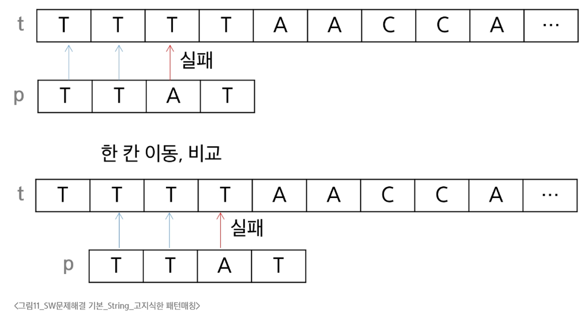
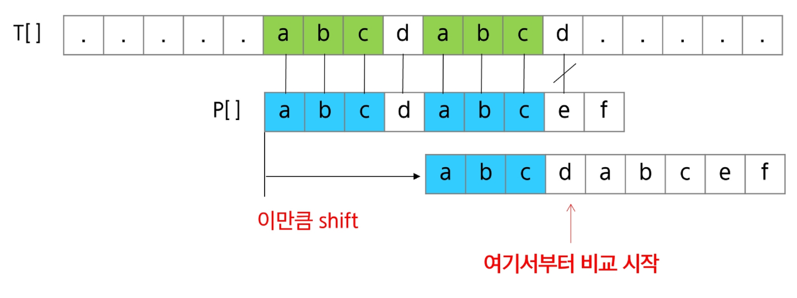
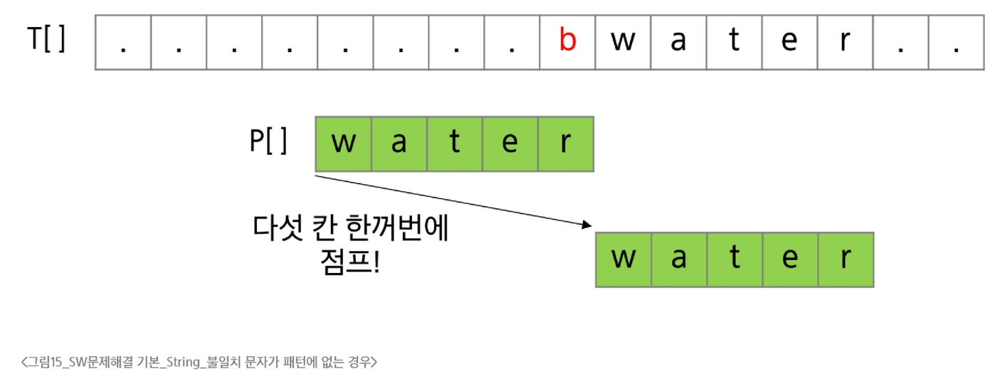
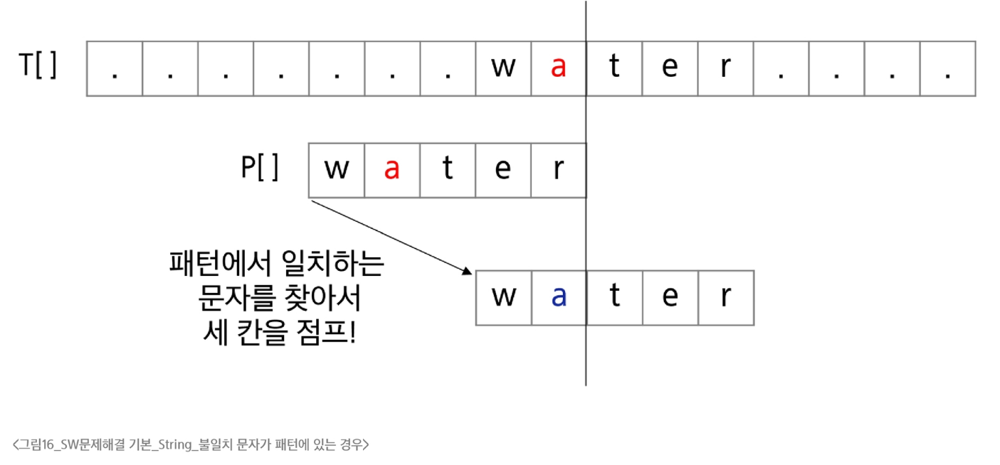

### 연산
- 문자열 뒤집기
  - 문자열을 역순으로 재정의
```python
s = 'Reverse this strings'
s = s[::-1]
```
  - 리스트로 변환 후 다시 문자열로 변환
```python
s = 'abcd'
s = list(s)
s.reverse()
s = ''.join(s)
```
- 회문
  - '기러기', '토마토'와 같이 똑바로 읽으나 거꾸로 읽으나 똑같은 문장이나 낱말
  - 문자열 길이의 반만 비교하면 됨
```python
def is_palindrone(txt):
    for i in range(len(txt)//2-1):
        if txt[i] != txt[len(txt)-i-1]:
            return False
    return True
```
- 사전 순서 비교
  - 비교 연산자 < 사용
    - 유니코드를 비교함
```python
def my_strcmp(s1, s2):
    if s1 < s2:     # s1이 s2보다 사전 순서상 앞서는 경우
        return -1
    elif s1 > s2:    # s1이 s2보다 사전 순서상 나중인 경우
        return 1
    else:    # s1과 s2 문자열의 내용이 같은 경우
        return 0
```
- 문자열을 숫자로 변환
```python
a = int('123')
b = float('3.14')
c = int('A0', 16)  # 문자열 'A0'을 16진법으로 해석해서 변환, 160
```

### 고지식한 패턴 검색
- 고지식한 알고리즘
  - 본문 문자열을 처음부터 끝까지 차례대로 순회하며 패턴 내의 문자들을 일일이 비교하는 방식

  - 본문의 비교위치 i, 패턴에서의 비교위치 j
    - 일치하면 i, j 증가, 실패하면 i는 이전 시작위치 다음으로, j는 맨 앞으로 초기화
```python
def brute_force(p, t):  # p: 찾을 패턴, t: 본문 문자열, 패턴이 있으면 인덱스를, 없으면 -1을 리턴
    i = 0   # t의 인덱스
    j = 0   # p의 인덱스
    M = len(p)
    N = len(t)
    while j < M and i < N:
        if t[i] != p[j]:    # 다른 글자인 경우
            i -= j
            j = -1
        i += 1
        j += 1
    if j == M:
        return i - M    # 검색 성공
    else:
        return -1   # 검색 실패
```
- 최악의 경우 시간복잡도가 O(MN)으로, 매우 큼

### KMP 알고리즘
- KMP 알고리즘
  - 패턴의 각 위치에서 매칭에 실패했을 때 돌아갈 위치를 미리 계산
    - 불일치가 발생했을 경우 이동할 다음 위치를 계산하는 전처리가 필요
    - 불일치가 발생한 글자의 앞 부분에 어떤 문자가 있는지를 미리 알고 있게 됨
  - 시간 복잡도는 O(M+N)으로, 고지식한 알고리즘보다 훨씬 작음

- LPS(Longest Prefix which is also Suffix) 배열
  - 접두사이자 접미사인 문자열의 최대 길이
  - 일치하지 않을 때 비교할 인덱스
  - next배열, pi배열으로 불리기도 함
  - 위 예시에서는 'abc'가 가장 긴 접두사이며 접미사임

### 보이어-무어 알고리즘
- 보이어 무어 알고리즘
  - 실제 검색에서 매우 빠른 성능으로, 상용 소프트웨어에서 채택하고 있는 알고리즘
  - 패턴 오른쪽 끝에 있는 문자가 불일치하고 이 문자가 패턴 내에 존재하지 않는 경우, 패턴의 길이만큼 이동

- 불일치 문자 휴리스틱(Bad-Character Heuristic)
  - 오른쪽 끝에 있는 문자가 불일치하고 이 문자가 패턴 내에 존재할 경우
  - 불일치 문자 오른쪽에서 일치한 부분을 고려해 점프


### 문자열 암호화
- 시저 암호 (Caesar chpher)
  - 평문에서 사용되고 있는 알파벳을 일정한 문자 수만큼 평행이동시켜서 암호화
  - 1만큼 평행이동한 암호화
    - 평문 'A' -> 암호문 'B'
    - 여기서 1을 키 값이라고 함
- 문자 변환표를 이용한 암호화 (단일 치환 암호화)
  - 단순한 카이사르 암호화(시저 암호)보다 훨씬 강력한 암호화 기법
  - 알파벳 하나를 다른 고정된 알파벳으로 바꾸는 방법
  - 암호표가 필수임