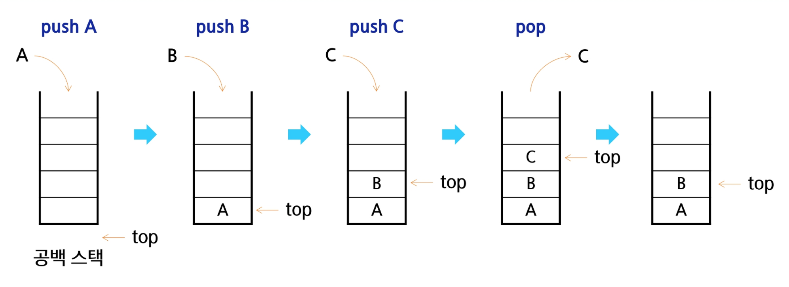

### Stack의 개념과 특성
- 스택(Stack)
  - 물건을 쌓아 올리듯 자료를 쌓아 올린 형태의 자료구조
- 스택(Stack)의 특성
  - 후입선출(LIFO, Last-In-First-Out)
    - 가장 마지막에 넣은 자료가 가장 먼저 나오는 것

### Stack의 기본 연산
- 스택의 연산
  - 삽입(Push)
    - 저장소에 자료를 저장하는 연산
  - 삭제(Pop)
    - 저장소에서 삽입한 자료의 역순으로 꺼내는 연산
  - 스택이 공백인지 아닌지를 확인하는 연산(isEmpty)
    - 스택이 비어있으면 True, 아니면 False 반환
  - 스택의 top에 있는 item(원소)을 반환하는 연산(peek)
    - 삭제는 하지않음
- 스택의 삽입/삭제 과정
  - 빈 스택에 원소 A, B, C를 차례로 삽입(push) 후 한번 삭제(pop)하는 연산 과정


### Stack 구현 실습
- Push 연산
  - append 메소드를 통해 리스트의 마지막에 데이터를 삽입
```python
def my_push(item):
    s.append(item)
```
  - 인덱스 연산을 활용한 구현
```python
def my_push(item, size):
    global top
    top += 1
    if top == size:
        print('overflow!')
    else:
        stack[top] = item
```
- 단순한 push 연산
  - 크기가 정해진 리스트와 인덱스 연산을 활용
```python
size = 10
stack = [0] * size
top = -1

my_push(10, size)
top += 1
stack[top] = 20
```
- pop 연산
  - 남은 데이터 중 가장 늦게 저장된 데이터를 삭제하는 연산
```python
def my_pop():
    if len(s) == 0: # underflow
        return
    else:
        return s.pop()
```
- 인덱스 연산을 이용한 pop 연산
  - 크기가 정해진 리스트와 인덱스 활용
```python
def my_pop()
    global top
    if top == -1:
        print('underflow')
        return 0
    else:
        top -= 1
        return stack[top+1]

print(pop())

if top > -1:
    top -= 1
    print(stack[top+1])
```
- 연습문제 1
  - 스택을 구현한 후, 이를 이용해 3개의 데이터를 저장하고 다시 3번 꺼내어 출력해 봅시다.
```python
stack = []
stack.append(1)
stack.append(2)
stack.append(3)

print(stack.pop())  # 3
print(stack.pop())  # 2
print(stack.pop())  # 1
```
```python
top = -1
stack = [0] * 10

top += 1
stack[top] = 1
top += 1
stack[top] = 2
top += 1
stack[top] = 3

top -= 1
print(stack[top+1])
top -= 1
print(stack[top+1])
top -= 1
print(stack[top+1])
```

### 괄호 검사
- 괄호검사 조건
  - 왼쪽 괄호의 개수와 오른쪽 괄호의 개수가 같아야 함
  - 같은 괄호에서 왼쪽 괄호는 오른쪽 괄호보다 먼저 나와야 함
- 연습문제 2
  - 다음 괄호의 짝을 검사하는 프로그램을 작성하고, 이를 이용해 올바른 사용 여부를 검사해봅시다.
```
()()((()))
((()((((()()((()())((())))))
```
```python
txt = input()
top = -1
stack = [0] * 100
ans = 1

for x in txt:
    if x == '(':    # 여는 괄호 push
        top += 1
        stack[top] = x
    elif x == ')':  # 닫는 괄호인 경우
        if top == -1:   # 스택이 비어있으면
            ans = 0
            break   # for x
        else:   # 여는 괄호 하나 버림
            top -= 1    # pop
if top != -1:   # 여는 괄호가 남아있으면
    ans = 0
```

### Function Call
- Function call
  - 프로그램에서의 함수 호출과 복귀에 따른 수행 순서를 관리
  - 가장 마지막에 호출된 함수가 가장 먼저 실행을 완료하고 복귀하는 후입선출 구조
- 시스템 스택
  - 함수 수행에 필요한 지역변수, 매개변수 및 수행 후 복귀할 주소 등 정보를 저장
  - 함수 호출이 발생하면 스택 프레임에 저장하여 시스템 스택에 삽입


### Stack 구현하기
```python
class Stack:
    def __init__(self, size=10): 
        self.top = -1   # top의 초기값은 -1임. 요소가 많기 때문
        self.container = [0] * size   # 빈 리스트가 아닌 특정 길이만큼 크기를 만들어줘야함
        self.size = size   # 스택의 크기를 저장

    def push(self, value):
        self.top += 1
        self.container[self.top] = value

    def pop(self):
      self.top -= 1
      return self.container[self.top+1]

stack1 = Stack()
stack1.push(10)
stack1.push(20)
print(stack1.container)   # [10, 20, 0, 0, 0, 0, 0, 0, 0, 0]
print(stack1.pop())   # 20
print(stack1.container)   # [10, 20, 0, 0, 0, 0, 0, 0, 0, 0]
stack1.push(9999)
print(stack1.container)   # [10, 9999, 0, 0, 0, 0, 0, 0, 0, 0]
```
