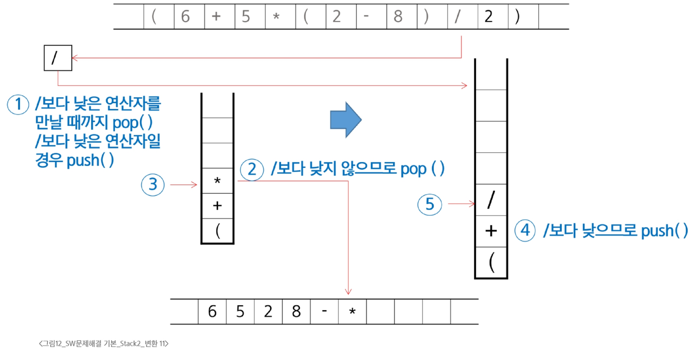

### 후위 표기법 변환
- 중위 표기법의 후위 표기법 변환 방법 1
  - 우선순위에 따라 각 연산자를 괄호를 사용하여 다시 표현
  - 각 연산자를 그에 대응하는 오른쪽 괄호의 뒤로 이동
  - 괄호 제거
- 변환 예시
```
1단계 : ((A*B) - (C/D))
2단계 : ((A B)* (C D)/)-
3단계 : AB*CD/-
```
- 중위 표기법의 후위 표기법 변환 방법 2(알고리즘 - Stack 이용)
  - 입력받은 중위 표기법에서 토큰을 읽는다.
  - 토큰이 피연산자면 토큰을 출력한다.
  - 토큰이 연산자(괄호 포함)일 때,
    - 이 토큰이 스택의 top에 저장되어 있는 연산자보다 우선순위가 높으면 스택에 push하고,
    - 그렇지 않다면 스택 top의 연산자의 우선순위가 토큰의 우선순위보다 작을 때 까지 스택에서 pop한 후 토큰의 연산자를 push한다. 만약 top에 연산자가 없으면 push한다.
  - 토큰이 오른쪽 괄호 ')'이면, 스택 top에 왼쪽 괄호 '('가 올 때 까지 스택에 pop연산을 수행하고, pop한 연산자를 출력한다. 왼쪽 괄호를 만나면 pop만 하고 출력하지는 않는다.
  - 중위 표기법에 더 읽을 것이 없다면 중지하고, 더 읽을 것이 있다면 1부터 반복한다.
  - 스택에 남아 있는 연산자를 모두 pop하여 출력한다.
  ` 스택 밖의 왼쪽 괄호는 우선순위가 가장 높으며, 스택 안의 왼쪽 괄호는 우선순위가 가장 낮다.`
- 후위 표기법 변환 예시
  - 변환할 중위 표기법으로 표현된 수식
```
(6 + 5 * (2 - 8) / 2)
```

  - 여는 괄호 '('는 스택 밖에 있을때는 우선순위가 3, 스택 안에 있을때는 우선순위가 0임
```
if top == -1 or isp[stack[top]] < icp[token]:
    push(token)
```


  - 토큰의 왼쪽 괄호는 스택 밖에서 우선순위가 높아 push되었지만, 스택 안에서는 우선순위가 '-'보다 낮아 '-'도 push가 됨

  - top에 왼쪽 괄호 '('가 올 때 까지 pop을 하고, pop한 연산자를 출력함
  - 왼쪽 괄호를 만나면 그 왼쪽 괄호를 pop하고 끝

  - '/'보다 낮은 연산자를 만날 때 까지 pop하고, pop한 연산자를 출력
  - 낮은 연산자를 만나면 '/'를 push

  - 수식이 끝나고, 스택이 비었을 때 정상 종료하고 결과값을 반환
```
6528-*2/+
```
- 코드 예시
```python
stack = [0] * 100
top = -1

icp = {'(': 3, '*': 2, '/': 2, '+': 1, '-': 1}  # 스택 밖에 있을 때의 우선순위(클수록 높음)
isp = {'(': 0, '*': 2, '/': 2, '+': 1, '-': 1}  # 스택 안에 있을 때의 우선순위(클수록 높음)

infix = '(6+5*(2-8)/2)'
postfix = ''

for token in infix:
    if token not in '(+-*/)':  # 피연산자면 후위식에 추가
        postfix += token
    elif token == ')':  # 닫는 괄호면, 여는 괄호를 만날 때까지 pop
        while top > -1 and stack[top] != '(':
            top -= 1
            postfix += stack[top+1]
        if top != -1:   # 전체 수식이 괄호로 둘러쌓이지 않은 경우를 대비
            top -= 1  # '(' 버림
    else:           # 연산자인 경우
        if top == -1 or isp[stack[top]] < icp[token]:   # 토큰의 우선순위가 더 높으면
            top += 1    # push
            stack[top] = token
        elif isp[stack[top]] >= icp[token]:     # 토큰과 같거나 더 높으면
            while top > -1 and isp[stack[top]] >= icp[token]:
                postfix += stack[top]
                top -= 1
            top += 1
            stack[top] = token
    print(postfix)
```

### 후위 표기법 연산
- 후위 표기법 연산 방법
  - 피연산자를 만나면 스택에 push한다.
  - 연산자를 만나면 필요한 만큼의 피연산자를 스택에서 pop하여 연산하고, 연산결과를 다시 스택에 push한다.
  - 수식이 끝나면, 마지막으로 스택을 pop하여 출력한다.
- 후위 표기법 연산 과정


### Backtracking
- 백트래킹
  - 후보해를 구성해 나가다가, 더 이상 해가 될 수가 없다고 판단되면 되돌아가서 다른 경로를 시도하는 방법
    - 가능성이 없는 경로는 더 이상 탐색하지 않고 되돌아가며 해결책을 찾음
  - 적용 예
    - N-Queens 문제
    - 미로 찾기
    - 스도쿠 풀이
    - 부분집합 탐색 등
- 백트래킹과 DFS와의 차이
  - Prunning(가지치기) 유무
    - Backtracking은 어떤 node에서 출발하는 경로가 해결책으로 이어질 것 같지 않으면 더이상 그 경로를 따라가지 않음
  - 조기 경로 차단
  - 경우의 수가 많은 경우
    - N!의 경우의 수를 가진 문제에 대해 DFS를 가하면 처리가 불가능
    - Backtracking을 적용하면 일반적으로는 경우의 수가 줄어들지만, 최악의 경우는 지수함수 시간을 필요로 하기 때문에 처리가 불가능
- 백트래킹 진행 절차
  - 상태 공간 트리의 DFS 실시
  - 각 node가 유망한가 점검
  - 만약 그 node가 유망하지 않으면, 해당 node의 부모 node로 돌아감
  - 돌아간 node에서 검색을 계속
