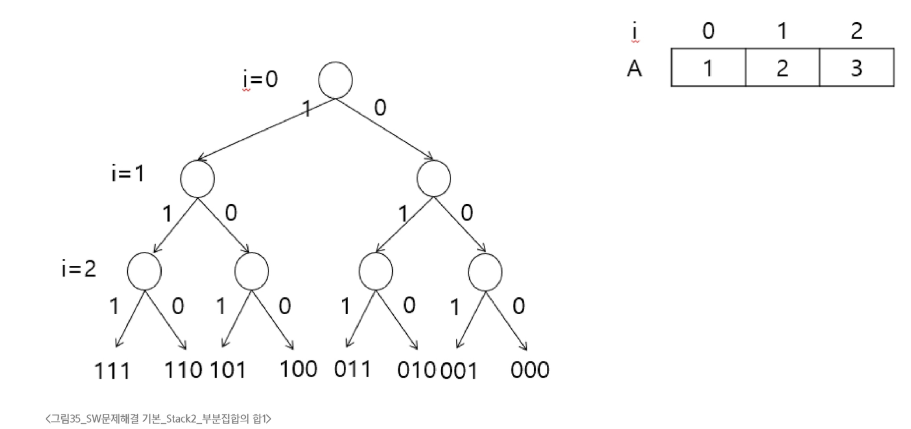
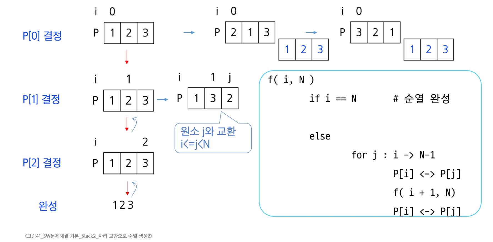

### 부분집합
- 각 원소가 부분집합에 포함되었는지를 loop를 이용하여 확인하고 부분집합을 생성
```python
bit = [0, 0, 0, 0]
for i in range(2):
    bit[0] = i
    for j in range(2):
        bit[1] = j
        for k in range(2):
            bit[2] = k
            for l in range(2):
                bit[3] = l
                print(bit)
```
- Powerset을 구하는 Backtracking 알고리즘
```python
def backtrack(a, k, n):  # a: 주어진 배열, k: 결정할 원소, n: 원소 개수
    c = [0] * MAXCANDIDATES

    if k == n:
        process_solution(a, k)  # 답이면 원하는 작업을 실행
    else:
        ncandidates = construct_candidates(a, k, n, c)
        for i in range(ncandidates):
            a[k] = c[i]
            backtrack(a, k+1, n)

def construct_candidates(a, k, n, c):
    c[0] = True
    c[1] = False
    return 2

def prosecc_solution(a, k):
    for i in range(k):
        if a[i]:
            print(num[i], end = ' ')
    print()

MAXCANDIDATES = 2
NMAX = 4
a = [0] * NMAX
num = [1, 2, 3, 4]
backtrack(a, 0, 3)
```


### 순열
- 단순하게 순열을 생성하는 방법
```python
for i1 in range(1, 4):
    for i2 in range(1, 4):
        if i2 != i1:
            for i3 in range(1, 4):
                if i3 != i1 and i3 != i2:
                    print(i1, i2, i3)
```
- Backtracking을 이용하여 {1, 2, 3, ..., NMAX}에 대한 순열 구하기
  - 접근 방법은 부분집합을 구하는 방법과 유사
```python
def backtrack(a, k, n):
    c = [0] * MAXCANDIDATES

    if k == n:
        for i in range(0, k):
            print(a[i], end = " ")
        print()
    else:
        ncandidates = construct_candidates(a, k, n, c)
        for i in range(ncandidates):
            a[k] = c[i]
            backtrack(a, k+1, n)

def construct_candidates(a, k, n, c):
    in_perm = [False] * (NMAX + 1)

    for i in range(k):
        in_perm[a[i]] = True

    ncandidates = 0
    for i in range(1, NMAX + 1):
        if in_perm[i] == False:
            c[ncandidates] = i
            ncandidates += 1
    return ncandidates

MAXCANDIDATES = 3
NMAX = 3
a = [0] * NMAX
backtrack(a, 0, 3)
```
### 가지치기
- 부분집합의 합
  - 집합 {1, 2, 3}의 원소에 대해 각 부분집합에서의 포함 여부를 트리로 표현

- A[i] 원소를 부분집합의 원소로 고려하는 재귀함수 (A는 서로 다른 자연수의 집합)
- 고려한 구간의 합 S에서, S > T(찾는 값)이면 중단
  - 남는 구간의 합 RS에서, S + RS < T이면 중단

### 순열 2
- A[1, 2, 3]의 모든 원소를 사용한 순열
  - 3개의 칸에 넣을 수 있는 수를 나열
  - 123, 132, 213, 231, 312, 321 총 6가지의 경우
- 자리 교환으로 순열 생성
```python
def f(i, N):
    if i == N:
        print(p)
    else:
        for j in range(i, N):
            p[i], p[j] = p[j], p[i]
            f(i+1, N)   # i+1 자리 결정
            p[i], p[j] = p[j], p[i]

p = [1, 2, 3]
N = 3
f(0, N)
```

