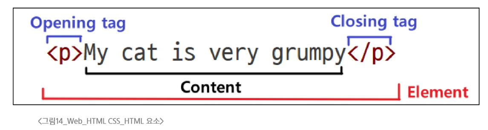
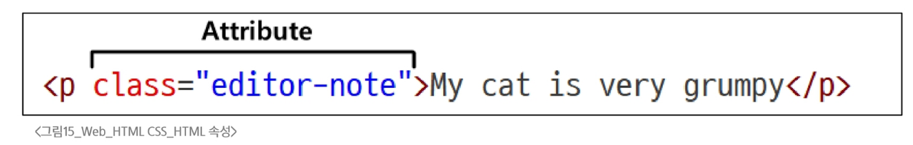
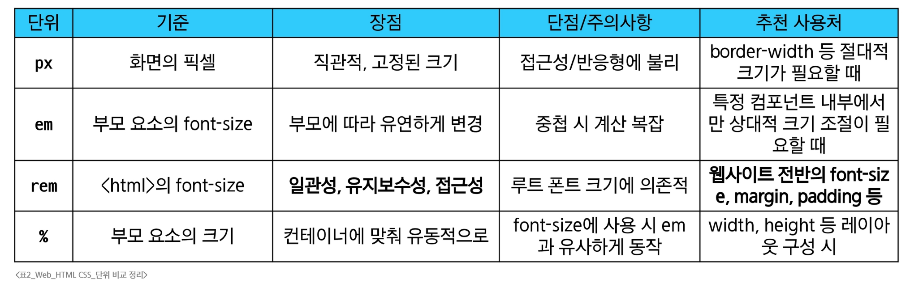
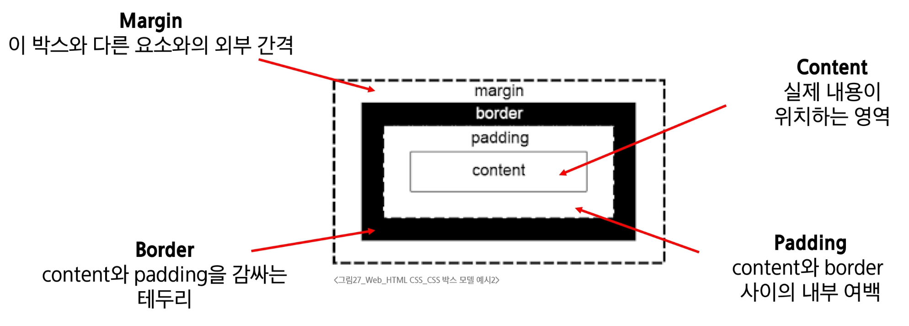
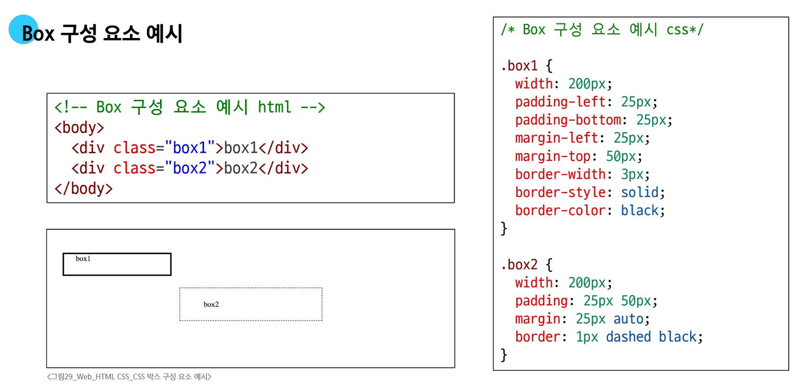

### 웹
- Web
  - Web site, Web application 등을 통해 사용자들이 정보를 검색하고 상호 작용하는 기술
- Web site
  - 인터넷에서 여러 개의 Web page가 모인 것으로, 사용자들에게 정보나 서비스를 제공하는 공간
- Web page
  - HTML, CSS 등의 웹 기술을 이용하여 만들어진, "Web site"를 구성하는 하나의 요소

### HTML
- HTML(HyperText Markup Language)
  - 웹 페이지의 의미와 구조를 정의하는 언어
- HyperText
  - 웹 페이지를 다른 페이지로 연결하는 링크
  - 참조를 통해 사용자하 한 문서에서 다른 문서로 즉시 접근할 수 있는 텍스트
  - 비선형성 / 상호연결성 / 사용자 주도적 탐색
- Markup Language
  - 태그 등을 이용하여 문서나 데이터의 구조를 명시하는 언어
  - 인간이 읽고 쓰기 쉬운 형태이며, 데이터의 구조와 의미를 정의하는 데 집중

### HTML 구조
- HTML 구조
  - ```<!DOCTYPE html>```
    - 해당 문서가 html로 문서라는 것을 나타냄
  - ```<html></html>```
    - 전체 페이지의 콘텐츠를 포함
  - ```<title></title>```
    - 브라우저 탭 및 즐겨찾기 시 표시되는 제목으로 사용
  - ```<head></head>```
    - HTML 문서에 관련된 설명, 설정 등 컴퓨터가 식별하는 메타데이터를 작성
 - ```<body></body>```
   - HTML 문서의 내용을 나타냄
   - 페이지에 표시되는 모든 콘텐츠를 작성
   - 한 문서에 하나의 body 요소만 존재
```html
<!DOCTYPE html>
<html lang="en">
<head>
    <meta charset="UTF-8">
    <title>My page</title>
</head>
<body>
    <p>This is my page</p>
</body>
</html>
```
- HTML element(요소)
  - 하나의 요소는 여는 태그와 닫는 태그 그리고 그 안의 내용으로 구성됨
  - 닫는 태그는 태그 이름 앞에 슬래시가 포함됨
    - 닫는 태그가 없는 태그도 존재
  - 

- HTML Attributes(속성)
  - 사용자가 원하는 기준에 맞도록 요소를 설정하거나 다양한 방식으로 요소의 동작을 조절하기 위한 값
  - 목적
    - 나타내고 싶지 않지만 추가적인 기능, 내용을 담고 싶을 때 사용
    - CSS에서 스타일 적용을 위해 해당 요소를 선택하기 위한 값으로 활용됨
  - 작성 규칙
    1. 속성은 요소 이름과 속성 사이에 공백이 있어야 함
    2. 하나 이상의 속성들이 있는 경우엔 속성 사이에 공백으로 구분함
    3. 속성 값은 열고 닫는 따옴표로 감싸야 함
  - 

- HTML 구조 예시
```html
<!DOCTYPE html>
<html lang="em">
<head>
    <meta charset="UTF-8">
    <title>My page</title>
</head>
<body>
    <p>My page</p>
    <a href="https://www.google.co.kr/">Google</a>
    
    
</body>
</html>
```
  - ```<p></p>```
    - Paragraph(문단)의 약자로, 텍스트 문단을 만드는 태그
  - ```<a></a>```
    - Anchor(닻)의 약자로, 다른 페이지로 이동시키는 하이퍼링크 태그
  - ```</img>```
    - Image(이미지)의 약자로, src에 지정된 그림을 보여주는 태그

### Text structure
- HTML Text Structure
  - HTML의 주요 목적 중 하나는 텍스트 구조와 의미를 제공하는 것
  - 예를들어 h1요소는 단순히 텍스트를 크게만 만드는 것이 아닌, 현재 문서의 최상위 제목이라는 의미를 부여하는 것
- 대표적인 HTML Text Structure
```html
<body>
    <h1>Main Heading</h1>
    <h2>Sub Heading</h2>
    <p>This is my page</p>
    <p>This is <em>emphasis</em></p>
    <p>Hi <strong>my name</strong> is Air</p>
    <ol>
        <li>파이썬</li>
        <li>알고리즘</li>
        <li>웹</li>
    </ol>
</body>
```
  - Heading & Paragraphs
    - h1~6, p
  - Lists
    - ol, ul, li
  - Emphasis & Importance
    - em, strong

### CSS
- CSS(Cascading Style Sheet)
  - 웹 페이지의 디자인과 레이아웃을 구성하는 언어
- CSS 적용방법
  - 인라인(Inline) 스타일
  - 내부(Internal) 스타일 시트
  - 외부(External) 스타일 시트
- 인라인(Inline) 스타일
  - HTML 요수 안에 style 속성 값으로 작성
```html
<h1 style="color: blue; background-color: yellow;">Hello World!<h1>
```
  - 가독성이 떨어지고, 유지보수 등의 어려움으로 인해 거의 사용하지 않음
- 내부(Internal) 스타일 시트
  - head 태그 안에 style 태그에 작성
```html
<style>
    h1 {
        color: blue;
        background_color: yellow;
    }
</style>
```
- 외부(External) 스타일 시트
  - 별도 CSS 파일 생성 후 HTML limk 태그를 사용해 불러오기
```html
<link rel="stylesheet" href="style.css">

/* style.css */
h1 {
    color: blue;
    background-color: yellow;
}
```

### CSS 구문
- CSS 기본 구조와 문법
  - 선택자(Selector)
    - '누구를' 꾸밀지 지정하는 부분
  - 선언(Declaration)
    - '어떻게' 꾸밀지에 대한 구체적인 한 줄의 명령
    - 속성과 값이 한 쌍으로 이루어지며, 세미콜론(;)으로 끝남
  - 속성(Property)
    - 바꾸고 싶은 스타일의 종류를 나타냄
  - 값(Value)
    - 속성에 적용할 구체적인 설정을 나타냄
- CSS Selectors(선택자)
  - HTML 요소를 선택하여 스타일을 적용할 수 있도록 하는 선택자
  - HTML 모든 요소를 선택하는 전체선택자(*)와 지정한 모든 태그를 선택하는 요소선택자(태그)가 있음
  - 클래스 선택자('.' (dot))
    - 주어진 클래스 속성을 가진 모든 요소를 선택
```html
.green {
    color: green;
}

<p class="green">
```
  - 아이디 선택자('#')
    - 주어진 아이디 속성을 가진 요소 선택
    - 문서에는 주어진 아이디를 가진 요소가 '하나만' 있어야 함
```html
#purple {
    color: purple;
}

<p id="purple">
```
  - 속성 선택자('[]'(대괄호))
    - 주어진 속성이나 속성값을 가진 모든 요소 선택
    - 속성의 존재 여부, 값의 일치/포함 등 다양한 조건으로 요소를 정교하게 선택 가능
```html
[class^="y"] {
    color: yellow;
}

<p class="yellow">
```

- CSS 결합자(Combinators)
  - 자손 결합자(" "(space))
    - 첫 번째 요소의 자손 요소들 선택
    - ```ex) p span은 <p> 안에 있는 모든 <span>을 선택 (하위 레벨 상관 없이)```
```html
.green li {
    color: brown;
}
```
  - 자식 결합자(">")
    - 첫 번째 요소의 직계 자식만 선택
    - ```ex) ul > li는 <ul> 안에 있는 모든 <li>를 선택 (한단계 아래 자식들만)```
```html
.green < span {
    font-size: 50px;
}
```

### CSS 선언
- CSS Declaration
  - 선택된 요소에 적용할 스타일을 구체적으로 명시하는 부분
  - 선택자로 요소를 선택했으니, 이제 중괄호 안에 '무엇을' 할지 정의
  - 속성(Property)
    - 스타일링하고 싶은 기능이나 특성을 의미
    - CSS가 미리 정의해 둔 키워드를 사용해야 함
    - font-size, background-color, width, margin, padding 등
  - 값(value)
    - 속성에 적용될 구체적인 설정
    - 속성이 받을 수 있는 값의 종류는 정해져 있음
    - 16px, lightgray, 100%, 10rem 등
  - 값의 단위(Units)
    - color: red; 처럼 키워드로 끝나는 값도 있지만, 크기나 간격을 나타낼 때는 단위가 필수적
    - 단위는 크게 절대 단위와 상대 단위로 나뉨
    - 절대 단위
      - px, pt, cm 등 단위 종류
      - 다른 요소의 영향을 받지 않는 고정된 크기
    - 상대 단위
      - %, em, rem, vw, vh 등 단위종류
      - 다른 요소(부모, 화면 표시 영역 등)의 크기에 따라 상대적으로 결정
    - 웹 디자인에서는 반응형 웹과 접근성 때문에 "상대 단위의 중요성"이 매우 높음
    - 값이 0일때는 단위를 생략하는 것이 권장
  - 절대 단위의 대표: "px"
    - 화면을 구성하는 가장 작은 단위인 '픽셀'을 기준으로 하는 절대 단위
    - 모니터 해상도에 따라 크기가 결정되며, 직관적이고 예측이 쉬움
    - 디자인 시안과 거의 동일한 결과물을 만들 수 있고, 요소의 크기를 명확하게 고정하고 싶을 때 유용
    - 사용자가 브라우저의 기본 폰트 크기를 변경해도 요소의 크기가 함께 조절되지 않아 접근성에 불리하고, 반응형 디자인에 한계가 있음
  - 상대 단위: "em"
    - 부모(parent) 요소의 font-size를 기준으로 크기가 결정되는 상대 단위
    - 만약 부모 요소에 font-size가 없다면, 그 상위 부모의 font-size를 상속 받음
    - 부모 요소의 크기에 따라 자식 요소의 크기를 유연하게 조절 가능
    - 중첩이 되면 문제가 발생
      - em 단위를 사용하는 요소가 중첩되면 기준 크기가 계속 변경되어 예측이 어려워짐
      - rem으로 해결가능
  - 상대 단위의 해결사: "rem"
    - "Root em"
    - 부모 요소가 아닌, 최상위 요소(root element)인 html의 font-size를 기준으로 크기가 결정
    - html의 기본 font-size는 대부분의 브라우저에서 16px
```html
.title {
    font-size: 2rem; /* 16px * 2 = 32px */
}

.content {
    font-size: 1rem; /* 16px * 1 = 16px */
    padding: 1.5rem; /* 16px * 1.5 = 24px */
}
```


### 명시도
- 명시도(Specificity)
  - 결과적으로 요소에 적용할 CSS 선언을 결정하기 위한 알고리즘
  - CSS Selector에 가중치를 계산하여 어떤 스타일을 적용할 지 결정
  - 동일한 요소를 가리키는 2개 이상의 CSS 규칙이 있는 경우, 가장 높은 명시도를 가진 Selector가 승리하여 스타일이 적용됨
- CSS
  - Cascading Style Sheet
  - 웹 페이지의 디자인과 레이아웃을 구성하는 언어
- Cascade
  - 계단식
  - 한 요소에 동일한 가중치를 가진 선택자가 적용될 때
  - CSS에서 마지막에 나오는 선언이 사용됨
- 명시도가 높은 순
  1. Importance
    - !important
  2. Inline 스타일
  3. 선택자
    - id 선택자 > class 선택자 > 요소 선택자
  4. 소스 코드 선언 순서
- !important
  - 다른 우선순위 규칙보다 우선하여 적용하는 키워드
  - Cascade의 구조를 무시하고 강제로 스타일을 적용하는 방식이므로 사용을 권장하지 않음

### 상속
- CSS 상속
  - 기본적으로 CSS는 상속을 통해 부모 요소의 속성을 자식에게 상속해 재사용성을 높임
- 상속되는 속성
  - Text 관련 요소(font, color 등)
- 상속되지 않는 속성
  - Box model 관련 요소(width, height 등)
  - position 관련 요소(position, top/right/bottom/left 등)
- MDN의 각 속성별 문서 하단에서 상속 여부를 확인할 수 있음

### CSS Box Model
- CSS Box Model
  - 웹 페이지의 모든 HTML 요소를 감싸는 사각형 상자 모델
  - 내용(content), 안쪽 여백(padding), 테두리(border), 외부 간격(margin)으로 구성되어 요소의 크기와 배치를 결정
- Box 구성 요소


