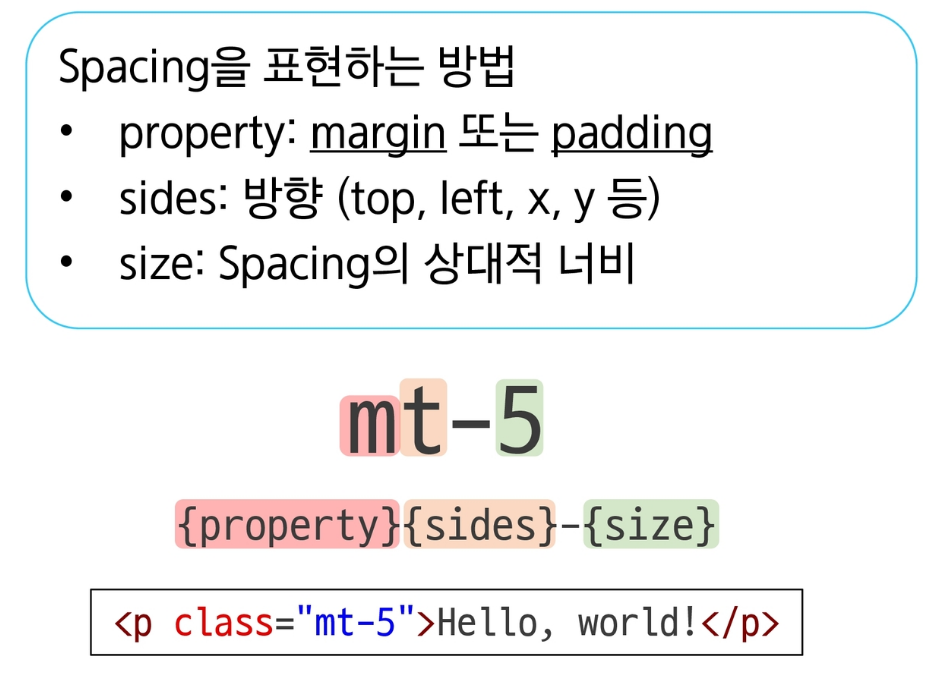
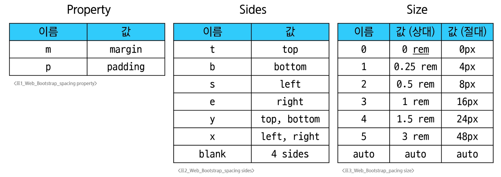

### Bootstrap
- Bootstrap
  - CSS 프론트엔드 프레임워크 (Toolkit)
  - 미리 만들어진 다양한 디자인 요소들을 제공하여 웹 사이트를 빠르고 쉽게 개발할 수 있도록 함
- CDN(Content Delivery Network)
  - 서버와 사용자 사이의 물리적인 거리를 줄여, 콘텐츠 로딩에 소요되는 시간을 최소화
    - 웹 페이지 로드 속도를 높임
  - 지리적으로 사용자와 가까운 CDN 서버에 콘텐츠를 저장해서 사용자에게 전달

### Bootstrap 사용 가이드
- Bootstrap 기본 사용법
  - Bootstrap에는 특정한 규칙이 있는 클래스 이름으로 스타일 및 레이아웃이 미리 작성되어 있음
  - 
  - 

### Reset CSS
- Bootstrap 적용 전/후 비교
  - Bootstrap을 HTML에 반영하면 일부 스타일이 바뀜
    - h1 요소의 폰트가 변경되고, body와의 여백이 사라짐
- Reset CSS
  - 모든 HTML 요소 스타일을 일관된 기준으로 재설정하는 간결하고 압축된 규칙 시트
  - 모든 브라우저는 각자의 'user agent styleshee'를 가지고 있는데, 이 설정이 브라우저마다 다름
  - 모든 브라우저에서 웹사이트를 동일하게 보이게 만들게끔 해야 함
    - 모두 똑같은 스타일 상태를 만들고 스타일 개발을 시작하면 된다!
- Normalize CSS
  - Reset CSS 방법 중 대표적인 방법
  - 웹 표준 기준으로, 브라우저 중 하나가 불일치한다면, 차이가 있는 브라우저를 수정하는 방법

### Component
- Bootstrap Component
  - Bootstrap에서 제공하는 UI 관련 요소
    - 네비게이션 바, 카드, 폼, 드랍 다운 등
