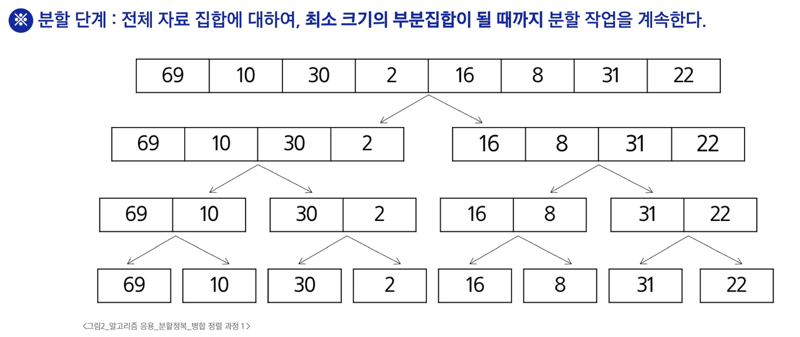
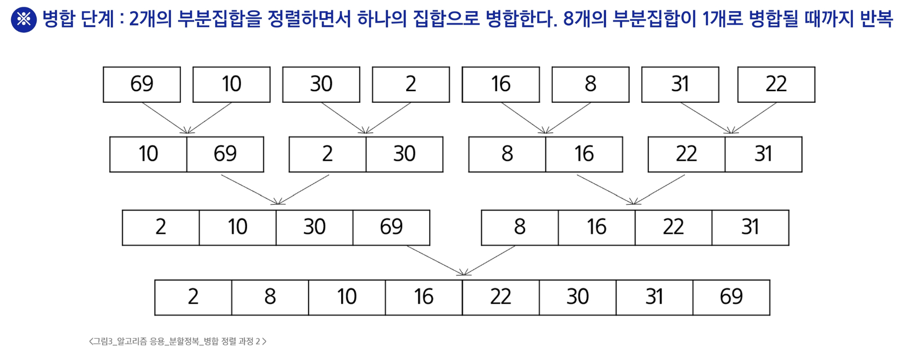

### 분할 정복 기법
- 분할 정복
  - 문제를 작은 하위 문제로 나누고 각각을 해결한 뒤, 그 결과를 결합하여 원래 문제를 해결하는 알고리즘 기법

### 병합 정렬
- 병합 정렬
  - 여러 개의 정렬된 자료의 집합을 병합하여 한 개의 정렬된 집합으로 만드는 방식
  - 자료를 최소 단위의 문제까지 나눈 후에 차례대로 정렬하여 최종 결과를 얻어냄
  - top-down 방식
- 병합 정렬 예시

### 퀵 정렬
- 퀵 정렬
  - 기준값을 중심으로 주어진 배열을 두 개로 분할하고, 각각을 정렬하여 전체 배열을 정렬하는 방식
- Partitioning
  1. 작업 영역을 정한다
  2. 작업 영역 중 가장 왼쪽에 있는 수를 Pivot 이라고 하자. (Pivot을 "기준"으로 해석한다.)
  3. Pivot 을 기준으로
    - 왼쪽에는 Pivot 보다 작은 수를 배치한다.(정렬 X)
    - 오른쪽에는 Pivot 보다 큰 수를 배치한다.(정렬 X)
- Hoare-Partition
  - 왼쪽 끝, 오른쪽 끝, 가운데 중 중간 값을 선택하는 것이 효율적임
  - 왼쪽 끝 값을 피봇으로 설정했다고 가정

### 이진 검색
- 이진 검색
  - 자료의 가운데에 있는 항목의 키 값과 비교하여 다음 검색의 위치를 결정하고 검색을 계속 진행하는 방법
- 이진 검색의 과정
  1. 자료의 중앙에 있는 원소를 고름
  2. 중앙 원소의 값과 찾고자 하는 목표 값을 비교
  3. 목표 값이 중앙 원소의 값보다 작으며 자료의 왼쪽 반에 대해서 새로 검색을 수행하고, 크다면 자료의 오른쪽 반에 대해서 새로 검색을 수행함
  4. 찾고자 하는 값을 찾을 때까지 위 과정을 반복
  - 이진 검색을 하기 위해서는 자료가 정렬된 상태여야 함!
  