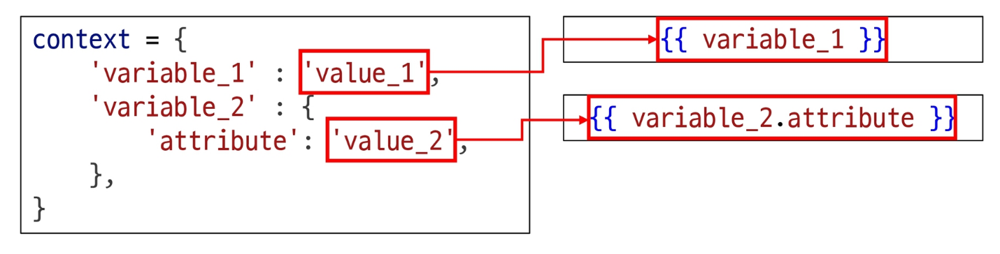
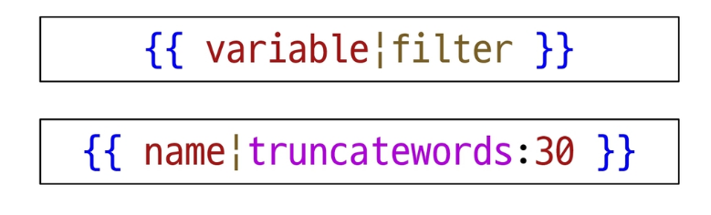
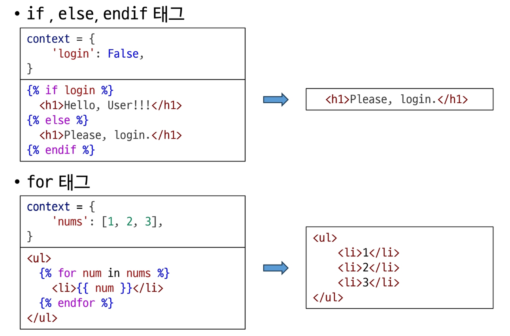
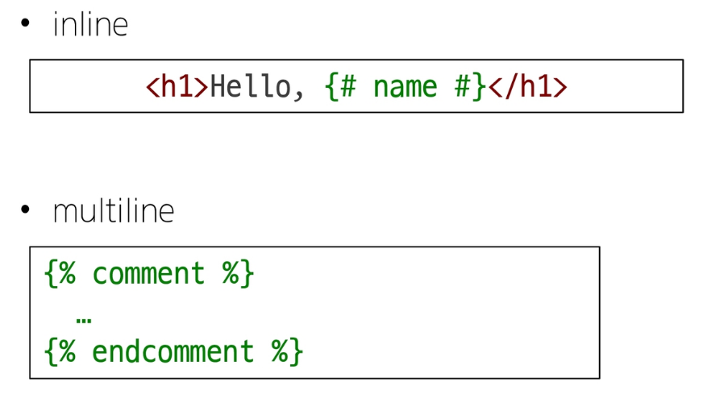

### Django Template system
- Django Template system
  - 파이썬 데이터(context)를 HTML 문서(Template)와 결합하여, 로직과 표현을 분리한 채 동적인 웹페이지를 생성하는 도구
  - '페이지 틀'에 '데이터'를 동적으로 결합하여 수많은 페이지를 효율적으로 만들어 내기 위함

### Django Template Language
- DTL
  - Template에서 조건, 반복, 변수 등의 프로그래밍적 기능을 제공하는 시스템
1. Variable
  - Django Template의 변수
  - render 함수의 세번째 인자로 딕셔너리 타입이 전달됨
  - 해당 딕셔너리 key에 해당하는 문자열이 template에서 사용가능한 변수명이 됨
  - dot('.')을 사용하여 변수 속성에 접근할 수 있음

2. Filters
  - 표시할 변수를 수정할 때 사용(변수 + '|' + 필터)
  - 연결이 가능하며 일부 필터는 인자를 받기도 함
  - 약 60개의 built-in template filters를 제공

3. Tags
  - 반복 또는 논리를 수행하여 제어 흐름을 만듦
  - 일부 태그는 시작과 종료 태그가 필요
  - 약 24개의 built-in template tags를 제공

4. Comments
  - 주석

### 템플릿 상속
- 템플릿 상속
  - 페이지의 공통요소를 포함
  - 하위 템플릿이 재정의 할 수 있는 공간을 정의
  - 여러 템플릿이 공통요소를 공유할 수 있게 해주는 기능
- 'extends'tag
  - 자식 템플릿이 부모 템플릿을 확장한다는 것을 알림
  - 반드시 자식 템플릿 최상단에 작성되어야 함
- 'block'tag
  - 하위 템플릿에서 재정의 할 수 있는 블록을 정의
  - 상위 템플릿에서 작성하며 하위 템플릿이 작성할 수 있는 공간을 지정하는 것

### HTML form
- 'form' element
  - 사용자로부터 할당된 데이터를 서버로 전송하는 HTML 요소
  