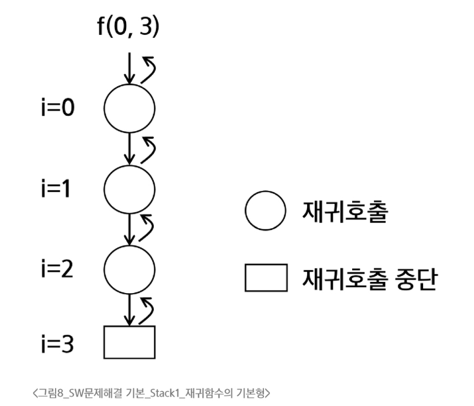

### 재귀호출
- 재귀호출
  - 함수가 자신과 같은 작업을 반복해야 할 때, 자신을 다시 호출하는 구조
  - 반복은 X
- 피보나치 수열
  - 0과 1로 시작하고 이전의 두 수의 합을 다음 항으로 하는 수열
```
0, 1, 1, 2, 3, 5, 8, ...
```
- 피보나치 수를 구하는 재귀함수
```python
def fibo(n):
    if n < 2:
        return n
    else:
        return fibo(n-1) + fibo(n-2)
```
- 재귀함수의 기본형
  - 현재 호출단계와 목표단계를 인자로 사용
    - 현재 단계 i, 목표 N을 인자로 가져서 f(i, N)이 기본형임

- 모든 배열 원소에 접근하는 재귀함수
- 배열 원소 검색

### Memoization
- 피보나치 재귀호출의 문제점
  - 피보나치 수를 구하는 함수를 재귀함수로 구현한 알고리즘은 '엄청난 중복 호출이 존재한다'는 문제 발생
- 메모이제이션(memoization)
  - 이전에 계산한 값을 메모리에 저장해서 전체적인 실행속도를 빠르게 하는 기술
    - 실행시간을 O(n)으로 줄일 수 있음
  - 동적 계획법의 핵심이 되는 기술
- Memoization을 적용한 피보나치
  - 계산된 적이 있는 피보나치 수는 저장된 값을 리턴
```python
def fibo1(n):
    if n >= 2 and memo[n] == 0:
        memo[n] = fibo1(n-1) + fibo1(n=2)
    return memo[n]

memo = [0] * (n+1)
memo[0] = 0
memo[1] = 1
```

### DP
- 동적계획법(DP, Dynamic Programming)
  - 입력 크기가 작은 부분 문제들을 먼저 해결한 뒤, 그 결과를 바탕으로 더 큰 문제를 순차적으로 해결하는 방식
  - 최적화 문제를 해결하는 알고리즘
- 피보나치 수열
  - DP 적용 문제
    - 문제의 최적 해가 그 하위 문제의 최적 해로부터 쉽게 구성될 수 있는 최적 부분구조여야 함
    - 동일한 하위 문제가 여러 번 반복되어 나타나는 중복 부분 문제여야 함
- 피보나치 수열 함수의 중복 호출 제거
  - 부분 문제로 나누는 일을 끝냈으면 가장 작은 부분 문제부터 해를 구하기
  - 그 결과는 테이블에 저장하고, 테이블에 저장된 부분 문제의 해를 이용하여 사상위 문제의 해를 구하기
- 피보나치 수열을 DP로 구현한 코드
```python
def fibo2(n):
    f = [0] * (n+1)
    f[0] = 0
    f[1] = 1
    for i in range(2, n+1):
        f[i] = f[i-1] + f[i-2]

    return f[n]
```
- DP의 구현 방식
  - recursive 방식 : fib1()
  - iterative 방식 : fib2()

### DFS
- 깊이 우선 탐색(DFS, Depth First Search)
  - 한 방향으로 가능한 한 깊게 탐색한 후, 더 이상 갈 곳이 없으면 되돌아와 다른 방향을 탐색
  - 비선형구조인 그래프 구조는 그래프로 표현된 모든 자료를 빠짐없이 검색하는 것이 중요한데, 깊이 우선 탐색과 너비 우선 탐색의 두 가지 방법이 사용됨
- DFS의 동작 원리
  - 시작 정점의 한 방향으로 갈 수 있는 경로가 있는 곳까지 탐색
  - 더 이상 갈 곳이 없게 되면, 가장 마지막에 만났던 갈림길 간선이 있는 정점으로 되돌아와서 다른 방향의 정점으로 탐색을 반복
- DFS 알고리즘
  - 시작 정점 v를 결정하여 방문한다.
  - 정점 v에 인접한 정점 중에서,
    - 방문하지 않은 정점 w가 있으면, 정점 v를 스택에 push하고 정점 w를 방문한다. 그리고 w를 v로 하여 다시 반복한다.
    - 방문하지 않은 정점이 없으면, 탐색의 방향을 바꾸기 위해 스택을 pop하여 받은 가장 마지막 방문 정점을 v로 하여 다시 반복한다.
  - 스택이 공백이 될 때까지 반복한다.

- DFS 코드 예시 (인접 행렬)
```python
arr = [[], ...]
visited = [0, ...]
stack = []
curr = 1
for idx in range(N):
  if arr[curr][idx] == 1:
    if visited[idx] == 0:
      stack.append(curr)
      curr = idx
```
- 길찾기 예시
```python
V = 7
E = 8
input = '1 2 1 3 2 4 2 5 4 6 5 6 6 7 3 7'
line = input.split()
```
-  인접 행렬로 저장하는 방법
```python
adj_arr = [[0] * (V + 1) for _ in range(V+1)]  # 인접 행렬 초기화

for i in range(E):
    s = line[i*2]
    e = line[i*2+1]
    adj_arr[s][e] = 1
    adj_arr[e][s] = 1
```
- 인접 리스트로 저장하는 방법
```python
adj_list = [[] for _ in range(V+1)]   # [[], [], [], [], [], [], [], []]
for i in range(E):
    s = line[i*2]
    e = line[i*2+1]
    adj_list[s].append(e)
    adj_list[e].append(s)
```

