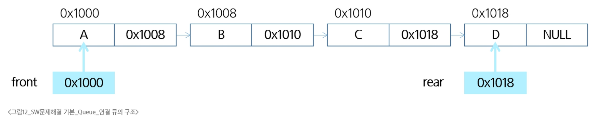

### Queue
- 큐(Queue)
  - 먼저 들어온 데이터가 먼저 나가는 선형 자료구조
    - 선입선출(FIFO, First In First Out)
    - 스택 구조는 후입선출(LIFO)
- 큐의 구조
  - 머리(Front) : 저장된 원소 중 첫번째 원소(또는 삭제된 위치)
  - 꼬리(Rear) : 저장된 원소 중 마지막 원소
- 큐의 기본 연산
  - 큐의 뒤쪽에 원소를 삽입 : enqueue()
  - 큐의 앞쪽에서 원소를 삭제하고 반환 : dequeue()
  - 공백 상태의 큐를 생성 : create_queue()
  - 큐가 공백 상태인지 확인 : is_empty()
  - 큐가 포화 상태인지 확인 : is_full()
  - 큐의 앞쪽(front)에서 원소를 삭제 없이 반환 : qpeek()
- 큐의 연산 과정
  - 공백 큐 생성 : create_queue()
    - front = rear = -1으로 초기화
  - 원소 A 삽입 : enqueue(A)
    - rear += 1
  - 원소 B 삽입 : enqueue(B)
    - rear += 1
  - 원소 반환/삭제 : dequeue()
    - front += 1
  - 원소 C 삽입 : enqueue(C)
    - rear += 1
  - 원소 반환/삭제 : dequeue()
    - front += 1
  - 원소 반환/삭제 : dequeue()
    - front += 1
  - front == rear이면, queue는 비어진 상태이므로 종료

### 선형 큐
- 선형 큐(Linear Queue)
  - 배열이나 연결형 리스트로 구현할 수 있음
  - 큐의 크기는 배열의 크기와 같음
- 선형 큐 구현
  - 초기 공백 큐 생성 : create_queue()
    - 크기 n인 1차원 배열 생성
    - front와 rear을 -1으로 초기화
```python
def create_queue():
    q = [0] * n
    front = -1
    rear = -1
```
  - 삽입 : enqueue(item)
    - 마지막 원소 뒤에 새로운 원소를 삽입하기 위해
    - rear값을 하나 증가시며 새로운 원소를 삽입할 자리를 지정
    - 그 인덱스에 해당하는 배열원소 Q[rear]에 item을 저장
```python
def enqueue(item):
    global rear
    if is_full:
        print("Queue_Full")
    else:
        rear += 1
        q[rear] = item
```
  - 삭제 : dequeue()
    - 가장 앞에 있는 원소를 삭제하기 위해
    - front 값을 하나 증가시켜 큐에 남아있는 첫번째 원소 이동
    - 새로운 첫번째 원소를 리턴함으로써 삭제와 동일한 기능을 함
```python
def dequeue()
    if is_empty():
        queue_empty()
    else:
        front += 1
        return Q[front]
```
  - 공백상태 및 포화상태 검사 : is_empty(), is_full()
    - 공백상태 : front == rear
    - 포화상태 : rear == n-1 (n : 배열의 크기, n -1 : 배열의 마지막 인덱스)
```python
def is_empty():
    return front == rear
 
def is_full():
    return rear == len(q) -1
```
  - 검색 : qpeek()
    - 가장 앞에 있는 원소를 검색하여 반환하는 연산
    - 현재 front의 한자리 뒤(front + 1)에 있는 원소, 즉 큐의 첫번째에 있는 원소를 반환
```python
def qpeek():
    if is_empty():
        print("Queue_Empty")
    else:
        return q[front+1]
```
#### 선형 큐 연습 문제
- 문제 : 세 개의 데이터 1, 2, 3을 차례로 큐에 삽입하고, 큐에서 세 개의 데이터를 차례로 꺼내서 출력
- 1, 2, 3이 출력되어야 함
```python
q = []
q.append(1)
q.append(2)
q.append(3)
q.pop(0)
q.pop(0)
q.pop(0)
```
```python
front = rear = -1
q = [0] * 10

rear += 1
q[rear] = 1
rear += 1
q[rear] = 2
rear += 1
q[rear] = 3

front += 1
print(q[front])
front += 1
print(q[front])
front += 1
print(q[front])
```

### 원형 큐
- 선형 큐 이용시의 문제점
  - rear = n-1일 때 포화상태로 인식하여 더 이상의 삽입을 수행하지 않음
    - 하지만 앞부분에는 활용할 수 있는 공간이 있음
  - 위 문제점을 해결하기 위해 1차원 배열을 사용!
    - 논리적으로 배열의 처음과 끝이 연결되어 원형 형태를 이룬다고 가정하고 사용함
- 원형 큐(Circular Queue)
  - 선형 큐의 공간 낭비를 막기 위해 처음과 끝이 연결된 구조
- 원형 큐의 구조
  - 초기 공백 상태
    - front = rear = 0
  - Index가 순환
    - front와 rear의 위치가 배열의 마지막 인덱스인 n-1을 가리킴
    - 그 다음부터 논리적 순환을 이루어 배열의 처음 인덱스인 0으로 이동
    - 이를 위해 나머지 연산자 mod를 사용함
  - front 변수
    - 공백 상태와 포화 상태 구분을 쉽게 하기 위해 front가 있는 자리는 사용하지 않고 항상 빈자리로 둠
- 선형 큐와 원형 큐 비교

- 원형 큐 구현
  - 초기 공백 큐 생성
    - 크기가 n인 1차원 배열을 생성
    - front와 rear을 0으로 초기화
```python
cq = [0] * n
front = rear = 0
```
  - 삽입 : enqueued(item)
    - 마지막 원소 뒤에 새로운 원소를 삽입하기 위해
    - rear값을 조정하여 새로운 원소를 삽입할 자리를 지정
    - 그 인덱스에 해당하는 배열원소 cQ[rear]에 item을 저장
```python
def enqueue(item):
    global rear
    if is_full():
        print("Queue_Full")
    else:
        rear = (rear + 1) % len(cq)
        cq[rear] = item
```
  - 삭제 : dequeue()
    - 가장 앞에 있는 원소를 삭제하기 위해
    - front 값을 조정하여 삭제할 자리를 지정
    - 새로운 front 원소를 리턴 함으로써 삭제와 동일한 기능을 함
```python
def dequeue():
    global front
    if is_empty():
        print("Queue_Empty")
    else:
        front = (front + 1) % len(cq)
        return cq[front]
```
  - 공백 상태 및 포화 상태 검사 : is_empty(), is_full()
    - 공백 상태 : front == rear
    - 포화 상태 : 삽입할 rear의 다음 위치 == 현재 front
```python
def is_empty():
    return front == rear

def is_full():
    return (rear + 1) % len(cq) == front
```

### 연결 큐
- 연결 큐(Linked Queue)
  - 연결 리스트를 이용해 구현한 큐
- 연결 큐의 구조
  - 큐의 원소 : 단술 연결 리스트의 노드
  - 큐의 원소 순서 : 노드의 연결 순서. 링크로 연결되어 있음
  - front와 rear : 첫번째, 마지막 노드를 가리키는 링크
  - 초기상태
    - front = rear = null
  - 공백상태
    - front = rear = null

- 연결 큐의 구현
```python
class Node:
    def __init__(self, item, n = None):
        self.item = item
        self.next = n
    
    def enqueue(item):  # 연결 큐의 삽입 연산
        global front, rear
        newNode = Node(item)  # 새로운 노드 생성
        if front == None:   # 큐가 비어있다면
            front = newNode
        else:
            rear.next = newNode
        rear = newNode
    def is_empty():
        return front == None
    
    def dequeue():  # 연결 큐의 삭제 연산
        global front, rear
        if is_empty():
            print("Queue_Empty")
            return None

        item = front.item
        front = front.next
        if front == None:
            rear = None
        return item
    
    def qpeek():
        return front.item

    def print_q():
        f = front
        s = ""
        while f:
            s += f.item + " "
            f = f.next
        return s

    front = None
    rear = None
```

### 우선순위 큐
- 우선순위 큐(Priority Queue)
  - 우선순위를 가진 항목들을 저장하는 큐
  - FIFO 순서가 아니라 우선순위가 높은 순서대로 먼저 나가게 됨
- 배열을 이용한 우선순위 큐
  - 배열을 이용하여 자료를 저장
  - 원소를 삽입하는 과정에서 우선순위를 비교하여 적절한 위치에 삽입하는 구조
  - 가장 앞에 최고 우선순위의 원소가 위치
  - 배열을 사용하기 때문에, 삽입이나 삭제 연산이 일어날 때 원소의 재배치가 발생
    - 소요되는 시간이나 메모리 낭비가 큼

### 큐의 활용
- 버퍼(Buffer)
  - 데이터를 한 곳에서 다른 한 곳으로 전송하는 동안 일시적으로 그 데이터를 보관하는 메모리의 영역
  - 버퍼를 채우는 것을 버퍼링이라고 함
- 버퍼의 자료 구조
  - 버퍼는 일반적으로 입출력 및 네트워크와 관련된 기능에서 이용됨
  - 순서대로 입력/출력/전달되어야 하므로 FIFO 방식의 자료구조인 큐가 활용
  