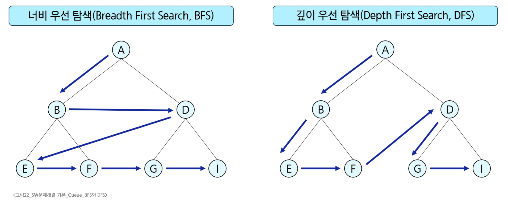

### BFS
- BFS(Breath First Search)
  - 탐색 시작점의 인접한 정점들을 모두 차례로 방문한 후에, 방문했던 정점을 시작점으로 다시 인접한 정점들을 차례로 방문하는 방식
- BFS vs DFS

- BFS 알고리즘
```python
def bfs(G, v):  # 그래프 G, 탐색 시작점 v
    visited = [0] * (n+1)   # n : 정점의 개수
    queue = []   # 큐 생성
    queue.append(v)     # 시작점 v를 큐에 삽입
    while queue:            # 큐가 비어있지 않은 경우
        t = queue.pop(0)        # 큐의 첫번째 원소 반환
        if not visited[t]:       # 방문하지 않은 곳이라면
            visited[t] = True       # 방문한 것으로 표시
            visit(t)        # 정점 t에서 할 일
            for i in G[t]:      # t와 연결된 모든 정점에 대해
                if not visited[i]:      # 방문되지 않은 곳이라면
                    queue.append(i)     # 큐에 넣기
```
```python
def BFS(G, v, n):       # 그래프 G, 탐색 시작점 v
    visited = [0] * (n+1)       # n: 정점의 개수
    queue = []              # 큐 생성
    queue.append(v)         # 시작점 v를 큐에 삽입
    visited[v] = 1
    while queue:        # 큐가 비어있지 않으면
        t = queue.pop(0)        # 큐의 첫 원소 반환
        visit(t)
        for i in G[t]:          # t와 연결된 모든 정점에 대해
            if not visited[i]:      # 인큐되지 않은 곳이라면
                queue.append(i)         # 큐에 넣기
                visited[i] = visited[t] + 1         # n으로부터 1만큼 이동
```
- BFS 예시
- 입력
```python
7 8
4 2 1 2 1 3 5 2 4 6 5 6 6 7 3 7
```
- 코드
```python
def bfs(s, V):
    visited = [0] * (V + 1)
    q = [s]     # 큐 생성

    visited[s] = 1      # 시작점 인큐표시
    
    while q:      # 탐색할 정점이 남아 있으면
        t = q.pop(0)       # dequeue
        print(t)        # visit(), 방문정점 출력
        for w in adj_lst[t]:    # 인접하고 미방문인 정점 인큐, 인큐 표시
            if visited[w] == 0:
                q.append(w)
                visited[w] = visited[t] + 1

V, E = map(int, input().split())        # 마지막 정점, 간선 수
arr = list(map(int, input().split()))

adj_list = [[] for _ in range(V+1)]     # V번행까지 준비
for i in range(E):
    v1, v2 = arr[i*2], arr[i*2+1]
    adj_lst[v1].append(v2)
    adj_lst[v2].append(v1)   # 방향표시가 없는 경우
```

