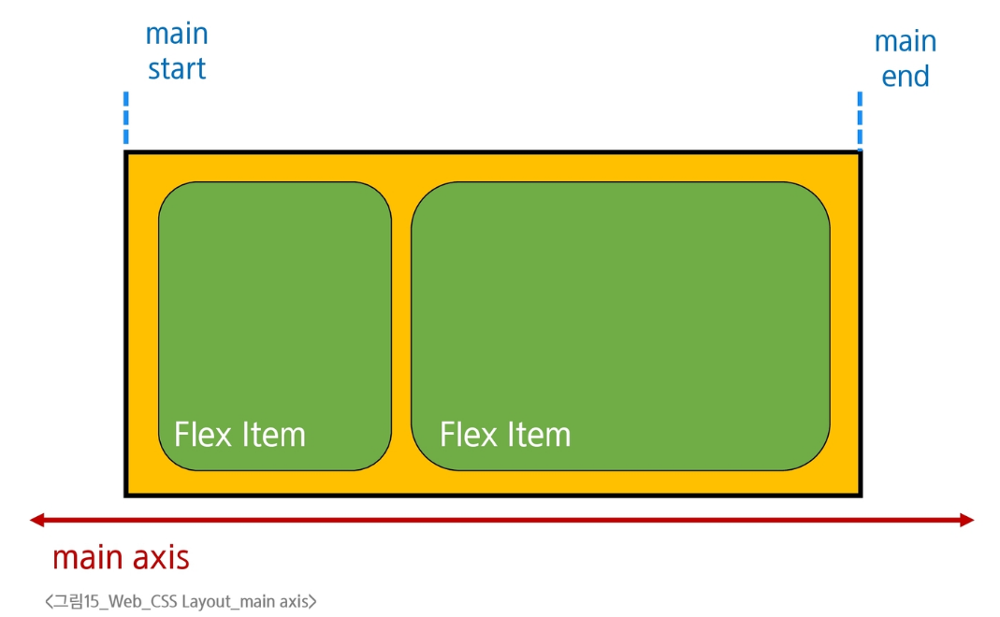
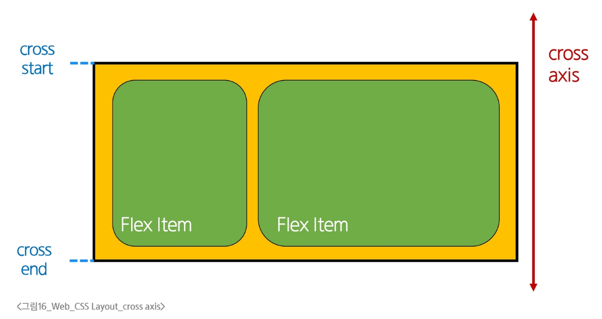
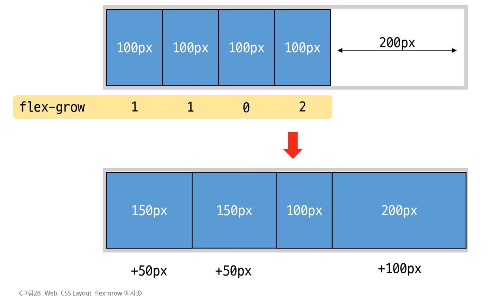

### CSS Box Model 
- block 타입
  - 하나의 독립된 덩어리처럼 동작하여 웹 페이지의 큰 구조와 단락을 만듬
  - 항상 새로운 행으로 나뉨(너비 100%)
  - width, height, margin, padding 속성을 모두 사용 가능
  - padding, margin, border로 인해 다른 요소를 상자로부터 밀어냄
  - width 속성을 지정하지 않으면 박스는 inline 방향으로 사용 가능한 공간을 모두 차지함
  - 대표적으로 h1~6, p, div, ul, li 태그가 있음
- block 타입의 대표: div
  - 다른 HTML 요소들을 그룹화하여 레이아웃을 구성하거나 스타일링을 적용할 수 있음
  - 헤더, 푸터, 사이드바 등 웹 페이지의 다양한 섹션을 구조화하는 데 가장 많이 쓰이는 요소
```html
<div class="container">
    <h1>제목</h1>
    <p>단락 내용입니다.</p>
</div>
<div>
    <p>콘텐츠</p>
</div>
```
- inline 타입
  - 문장 안의 단어처럼 흐름에 따라 자연스럽게 배치되는 요소
    - 문장 속 단어를 형광펜으로 칠하는 것과 같음
  - 줄을 바꾸지 않고, 텍스트의 일부에만 다른 스타일을 적용할 때 사용
    - 콘텐츠의 크기만큼만 영역을 차지
  - width와 height 속성을 사용할 수 없음
  - 수직 방향(상하): padding, margin, border가 적용되지만, 다른 요소를 밀어낼 수는 없음
  - 수평 방향(좌우): padding, margin, border가 적용되어 다른 요소를 밀어낼 수 있음
  - 대표적으로 a, img, span, strong 태그가 있음
- inline 타입의 대표: span
  - 자체적으로 시각적 변화 없음
    - 스타일을 적용하기 전까지는 특별한 변화 없음
  - 텍스트 일부 조작
    - 문장 내 특정 단어나 구문에만 스타일을 적용할 때 유용
  - 블록 요소처럼 줄바꿈을 일으키지 않으므로, 문서의 구조에 큰 변화를 주지 않음
```html
<p>이 문장에서 <span style="color: blue;">파란색</span> 단어만 색상이 다릅니다.</p>
```

### Normal flow
- Normal flow
  - 일반적인 흐름 또는 레이아웃을 변경하지 않은 경우 웹 페이지 요소가 배치되는 방식


### 기타 display 속성
- Inline-block 타입
  - inline과 block의 특징을 모두 가진 특별한 display 속성 값
    - 줄바꿈없이 크기 지정 가능
  - width 및 height 속성 사용 가능
  - padding, margin 및 border로 인해 다른 요소가 상자에서 밀려남
  - block이 아래로 나열되는 것이 아닌, 우측으로 나열됨
- none 타입
  - 요소를 화면에 표시하지 않고, 공간조차 부여되지 않음

### CSS Position
- CSS Layout
  - 각 요소의 위치와 크기를 조정하여 웹 페이지의 디자인을 결정하는 것
  - 요소들을 상하좌우로 정렬하고, 간격을 맞추고, 전체적인 뼈대를 구성
  - 핵심 속성: display(block, inline, flex, grid, ...)
- CSS Position
  - 요소를 Normal Flow에서 제거하여 다른 위치로 배치하는 것
  - 다른 요소 위에 올리기, 특정 위치에 고정하기 등
  - 핵심 속성: position(static, relative, absolute, fixed, sticky, ...)
- Position 이동 방향
  - 네 가지 방향 속성(top, bottom, left, right)을 이용해 요소의 위치를 조절할 수 있음
  - 겹치는 요소의 쌓이는 순서를 조절할 수 있음

### Position 유형
- Position: static
  - 요소를 Normal Flow에 따라 배치
    - 기본 값임
  - top, right, bottom, left 속성이 적용되지 않음
- Position: relative
  - 요소를 Normal Flow에 따라 배치하나, 자신의 원래 위치(static)을 기준으로 이동
  - top, right, bottom, left 속성으로 위치를 조정
  - 다른 요소의 레이아웃에 영향을 주지 않음
    - 요소가 차지하는 공간은 static일 때와 같음
- Position: absolute
  - 요소를 Normal Flow에서 제거
  - 가장 가까운 relative 부모 요소를 기준으로 이동
    - 요소가 제거되기 때문에 기준점을 새로 탐색해야함
    - 만족하는 부모 요소가 없다면 body 태그를 기준으로 함
  - top, right, bottom, left 속성으로 위치를 조정
  - 문서에서 요소가 차지하는 공간이 없어짐
- Position: fixed
  - 요소를 Normal Flow에서 제거
  - 현재 화면영역(viewport)을 기준으로 이동
  - 스크롤해도 항상 같은 위치에 유지됨
  - top, right, bottom, left 속성으로 위치를 조정
  - 문서에서 요소가 차지하는 공간이 없어짐
- Position: sticky
  - relative와 fixed의 특성을 결합한 속성
  - 스크롤 위치가 임계점에 도달하기 전에는 relative처럼 동작
  - 스크롤 위치가 임계점에 도달하면 fixed처럼 화면에 고정
  - 다음 sticky 요소가 나오면 이전 sticky 요소의 자리를 대체
    - 이전 sticky 요소와 다음 sticky 요소의 위치가 겹치게 되기 때문

### z-index
- z-index
  - 요소의 쌓임 순서를 정의하는 속성
  - 정수 값을 사용해 Z축 순서를 지정
    - 값이 클수록 요소가 위에 쌓이게 됨
  - static이 아닌 요소에만 적용
  - 기본값은 auto로, 부모 요소의 z-index 값에 영향을 받음
  - 같은 부모 내에서만 z-index 값을 비교하고, 값이 같으면 HTML 문서 순서대로 쌓임
  - 부모의 z-index가 낮으면 자식의 z-index가 아무리 높아도 부모보다 위로 올라갈 수 없음

### CSS Flexbox
- CSS Flexbox
  - 요소를 행과 열 형태로 배치하는 1차원 레이아웃 방식
- Flexbox 구성 요소
  - main axis(주 축)
    - flex item들이 배치되는 기본 축
    - main start에서 시작하여 main end 방향으로 배치(기본 값)
    - 
  - cross axis(교차 축)
    - main axis에 수직인 축
    - cross start에서 시작하여 cross end 방향으로 배치(기본 값)
    - 
  - Flex Container
    - display: flex; 혹은 display: inline-flex; 가 설정된 부모 요소
    - 이 컨테이너의 1차 자식 요소들이 Flex item이 됨
    - flexbox 속성 값들을 사용하여 자식 요소 Flex item들을 배치하는 추세
  - Flex Item
    - Flex Container 내부에 레이아웃 되는 항목
    - 자유로운 순서 변경 및 정렬 가능

### Flexbox 속성
1. Flex Container 지정
  - display 속성을 flex로 설정하면, Flex Container로 지정됨
  - flex item 은 기본적으로 행(기본값인 가로방향)으로 나열
  - flex item 은 주 축의 시작 선에서 시작
  - flex item 은 교차 축의 크기를 채우기 위해 늘어남
2. flex-direction
  - flex item이 나열되는 방향을 지정
  - 속성
    - row(기본값): 아이템을 가로 방향으로, 왼쪽에서 오른쪽으로 배치
    - colums: 아이템을 세로 방향으로, 위에서 아래로 배치
    - "-reverse"로 지정하면 flex item 배치가 반대로 됨
3. flex-wrap
  - flex item 목록이 flex container의 한 행에 들어가지 않을 경우, 다른 행에 배치할지 여부 설정
  - 속성
    - nowrap(기본 값): 줄 바꿈을 하지 않음
    - wrap: 여러 줄에 걸쳐 배치될 수 있게 설정
  - 화면 너비를 줄여서 확인 가능

4. justify-content
  - 주 축을 따라 flex item 들을 정렬하고 간격을 조정
  - 속성
    - flex-start(기본값): 주 축의 시작점으로 정렬
    - center: 주 축의 중앙으로 정렬
    - flex-end: 주 축의 끝점으로 정렬

5. align-content
  - 컨테이너에 여러 줄의 flex item이 있을 때, 그 줄들 사이의 공간을 어떻게 분배할 지 지정
    - flex-wrap이 wrap 또는 wrap-reverse로 설정된 여러 행으로 적용됨
    - (flex-wrap이 nowrap으로 설정된 경우) Flex 아이템이 두 줄 이상일 때만 의미가 있음
  - 속성
    - strech(기본값): 여러 줄을 교차 축에 맞게 늘려 빈 공간을 채움
    - center: 여러 줄을 교차 축의 중앙에 맞춰 정렬
    - flex-start: 여러 줄을 교차 축의 시작점(보통 위쪽)에 맞춰 정렬
    - flex-end: 여러 줄을 교차 축의 끝점(보통 아래쪽)에 맞춰 정렬

6. align-items
  - 컨테이너 안에 있는 flex item 들의 교차 축 정렬 방법을 지정
  - 속성
    - strech(기본값): 아이템을 교차 축 높이가 꽉 차도록 늘림
    - center: 아이템을 교차 축의 중앙에 맞춰 정렬
    - flex-start: 아이템을 교차 축의 시작점(가로 방향일 경우 위쪽)에 맞춰 정렬
    - flex-end: 아이템을 교차 축의 끝점(가로 방향일 경우 아래쪽)에 맞춰 정렬

7. align-self
  - 컨테이너 안에 있는 flex item 들을 교차 축을 따라 개별적으로 정렬
  - 속성
    - auto(기본값): 부모 컨테이너의 align-items 속성 값을 상속
    - strech: 해당 아이템만 교차 축 방향으로 늘어나 컨테이너를 꽉 채우도록 정렬
    - center: 해당 아이템만 교차 축의 중앙에 정렬
    - flex-start: 해당 아이템만 교차 축의 시작점(가로 방향일 경우 위쪽)에 정렬
    - flex-end: 해당 아이템만 교차 축의 끝점(가로 방향일 경우 아래쪽)에 정렬

- 목적에 따른 속성 분류
  - 배치 (flex-direction, flex-wrap)
  - 공간 분배 (justify-content, align-content)
  - 정렬 (align-items, align-self)

- 속성 쉽게 이해하는 방법
  - justify - 주축
  - align - 교차 축

8. flex-grow
  - 남는 행 여백을 비율에 따라 각 flex item에 분배
  - flex item 이 컨테이너 내에서 확장하는 비율을 지정
  - 
    - 남는 여백을 분배하는 것에 주의할 것!

9. flex-basis
  - flex item 의 초기 크기 값을 지정
  - flex-basis 와 width 값을 동시에 적용한 경우 flex-basis 가 우선


### 마진 상쇄
- 마진 상쇄(Margin collapsing)
  - 두 block 타입 요소의 martin top과 bottom이 만나 더 큰 margin으로 결합되는 현상
  - 요소 간 간격을 일관되게 유지할 수 있고, 요소 간의 간격을 더 예측 가능하고 관리하기 쉽게 만들 수 있음
  