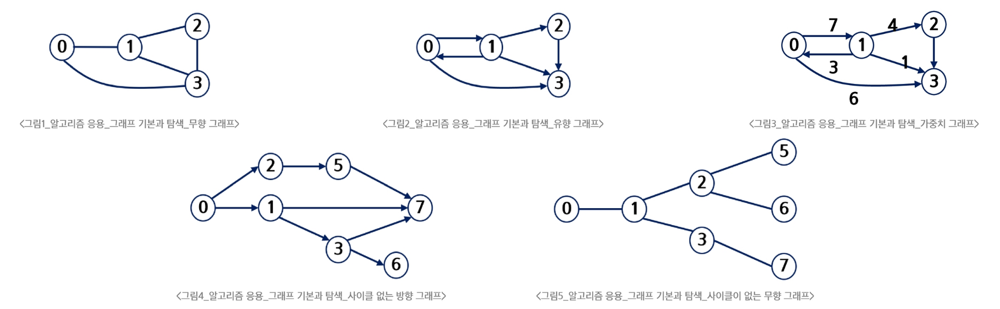
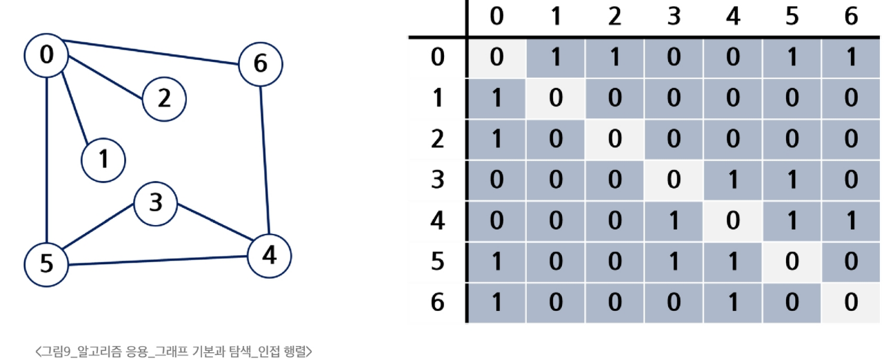
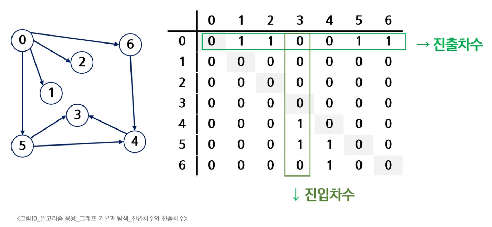
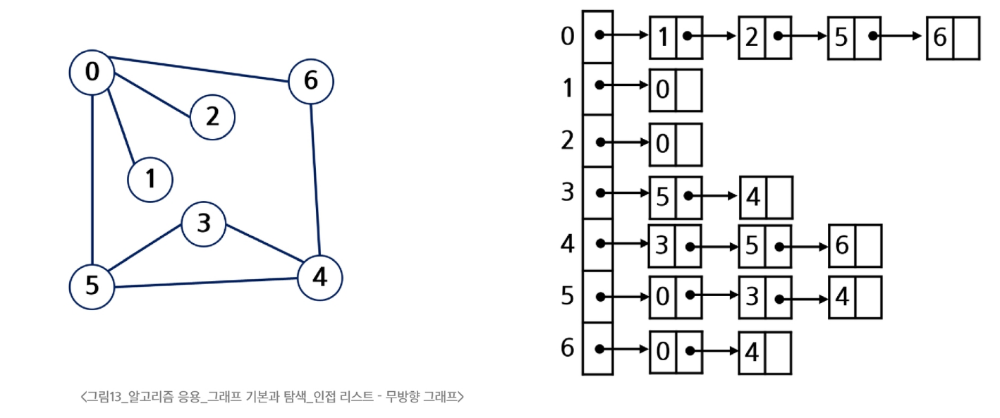
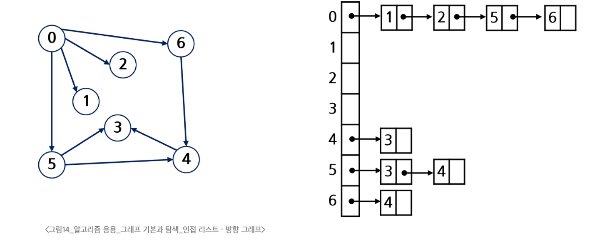
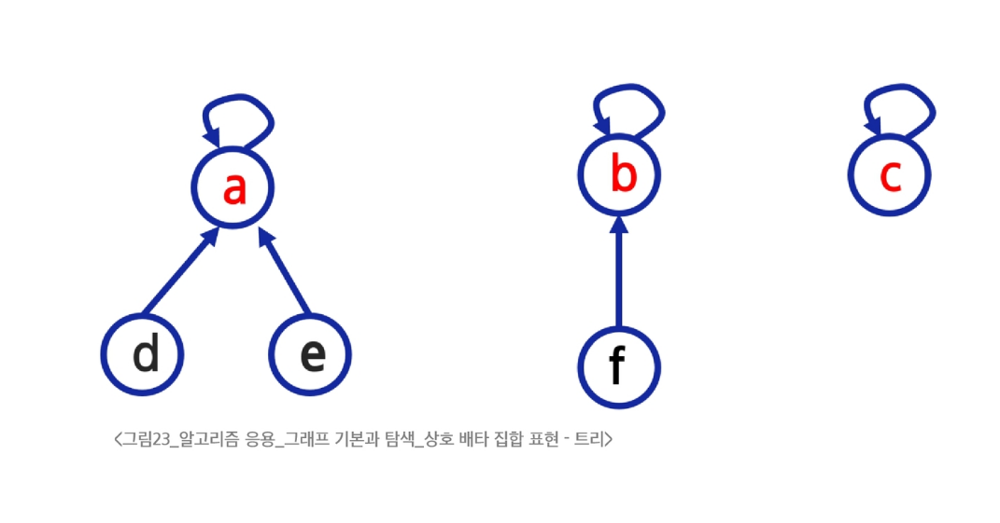

### 그래프
- 그래프
  - 아이템(사물 또는 추상적 개념)들과 이들 사이의 연결 관계를 표현
  - 정점(Vertex)들의 집합과 이들을 연결하는 간선(Edge)들의 집합으로 구성된 자료 구조
    - |V|: 정점의 개수, |E|: 그래프에 포함된 간선의 개수
    - |V| 개의 정점을 가지는 그래프는 최대 |E| = |V| * (|V| - 1) / 2 개의 간선을 가질 수 있음
- 그래프 유형
  - 무향(무방향) 그래프 = 양방향 그래프
  - 유향(방향) 그래프
  - 가중치 그래프
  - 사이클 없는 방향 그래프(DAG, Directed Acyclic Graph)
    - 사이클 : 그래프를 따라 이동하다 다시 처음으로 돌아올 수 있는 것(한번씩만 방문할 때)
  - 완전 그래프 : 정점들에 대해 가능한 모든 간선들을 가진 그래프
  - 부분 그래프 : 원래 그래프에서 일부의 정점이나 간선을 제외한 그래프
  
- 인접
  - 두 개의 정점에 간선이 존재(연결됨)하면 서로 인접해 있다고 함
  - 완전 그래프에 속한 임의의 두 정점들은 모두 인접한 상태
- 그래프 경로
  - 경로 : 간선들을 순서대로 나열한 것
    - 간선 : (0, 2), (2, 4), (4, 6)
    - 정점 : 0 - 2 - 4 - 6
  - 경로 중 한 정점을 최대한 한번만 지나는 경로를 단순경로라고 함
    - 0 - 2 - 4 - 6
- 그래프 표현
  - 인접 행렬(Adjacent matrix)
    - |V| X |V| 크기의 2차원 배열을 이용해서 간선 정보를 저장
  - 인접 리스트
    - 각 정점마다 해당 정점과 인접한 정점 정보를 저장
- 인접 행렬
  - |V| X |V| 정방 행렬
  - 행 번호와 열 번호는 그래프의 정점에 대응
  - 두 정점이 인접되어 있으면 1, 그렇지 않으면 0으로 표현
  - 무향 그래프
    - i번째 행의 합 = i번째 열의 합 = Vi의 차수
    - 
  - 유향 그래프
    - 행 i의 합 = Vi의 진출 차수
    - 열 i의 합 = Vi의 진입 차수
    - 
  - 인접 행렬의 장점
    - 직관적임, 특정 연결 검색이 빠름
  - 인접 행렬의 단점
    - 메모리 낭비가 심함
- 인접 리스트
  - 각 정점에 대한 인접 정점들을 순차적으로 표현
  - 하나의 정점에 대한 인접 정점들을 각각 노드로 하는 연결 리스트로 저장
  - 무향 그래프
    - 무방향 그래프 노드 수 = 간선의 수 * 2
    - 각 정점의 노드 수 = 정점의 차수
    - 
  - 유향 그래프
    - 방향 그래프 노드 수 = 간선의 수
    - 각 정점의 노드 수 = 정점의 진출 차수
    - 
  - 인접 리스트의 장점
    - 메모리를 효율적으로 사용 가능
  - 인접 리스트의 단점
    - 특정 연결 정보를 조회하는 것이 느림

### DFS
- DFS(Depth First Searsh, 깊이 우선 탐색)
- stack vs 재귀호출
  - 재귀호출
    - 장점: 구현이 쉽다
    - 단점: 느리다, 재귀 깊이 제한
  - stack
    - 장점: 빠르다
    - 단점: 구현이 어렵다

### BFS
- BFS(Breadth First Search, 너비 우선 탐색) 알고리즘
  - queue, visited 사용

### DFS vs BFS
- DFS
  - 경로를 출력하는 경우
  - 갈 수 있는 경로의 수
- BFS
  - 몇 번 만에 가는지?
  - 최단 거리 찿기

### Union-Find (Disjoint set)
- Disjoint set(서로소 집합)
  - 서로 공통 원소가 없는 집합(교집합이 없는 집합들)
  - 상호 배타 집합
    - 동시에 일어날 수 없는 경우, 공통이 없는 경우를 말함
    - 집합론에서는 서로소와 같은 뜻으로 사용됨
  - 연결리스트, 트리로 표현 가능
  - 대표자(representative)
    - 각 집합을 대표하는 하나의 원소를 말함
- 서로소 집합 연산
  - Make-Set(x)
    - x를 원소로 가진 집합을 만듬
  - Find-Set(x)
    - x가 속한 집합의 대표 원소를 반환
  - Union(x, y)
    - y가 속한 집합과 x가 속한 집합의 합집합을 만듬
    - x가 합집합의 대표 원소가 됨
- 상호 배타 집합 표현 - 트리
  - 하나의 집합을 하나의 트리로 표현
  - 자식 노드가 부모 노드를 가리키며 루트 노드가 대표자가 됨
  - 
  