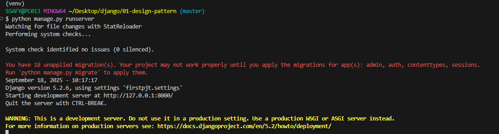
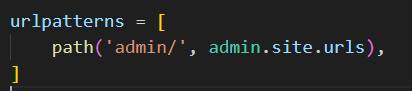
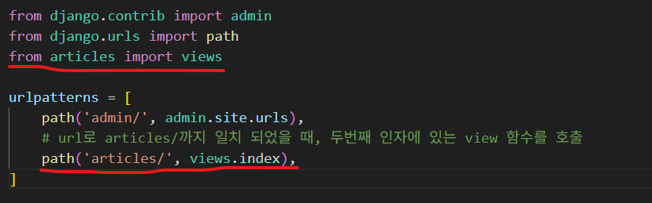
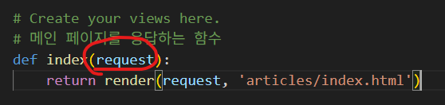
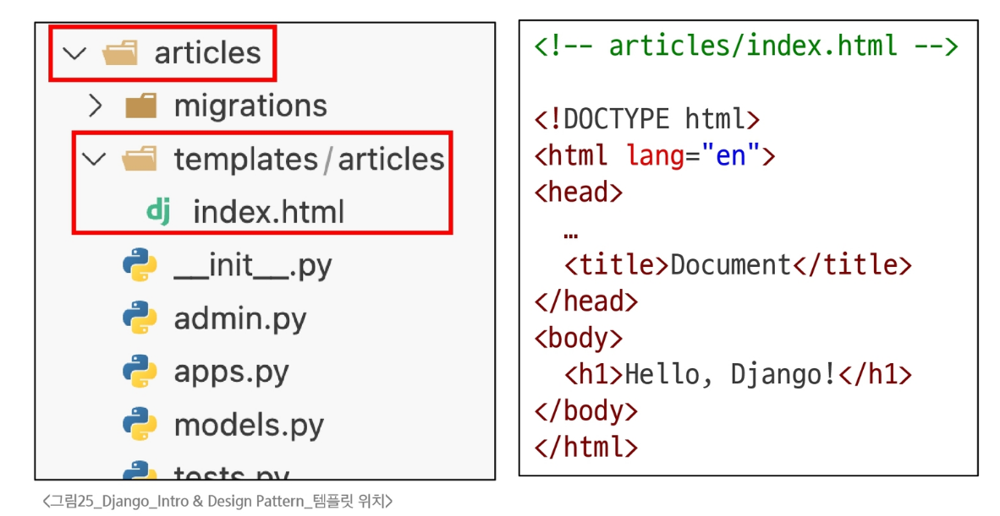

### Web Framework
- Web Framework
  - 웹 애플리케이션을 빠르게 개발할 수 있도록 도와주는 도구
  - 개발에 필요한 기본 구조, 규칙, 라이브러리 등을 제공
    - (로그인/로그아웃, 회원관리, 데이터베이스, 보안 등)

### Django Framework
- django
  - python 기반의 대표적인 웹 프레임워크

### 가상 환경
- 가상 환경
  - 하나의 컴퓨터 안에서 또 다른 독립된 파이썬 환경
  - 패키지 충돌을 피하거나, 여러 프로젝트의 다른 패키지 버전 사용을 위한 독립적인 개발 환경의 필요성
- 가상 환경 생성
```
python -m venv venv
```
  - 뒤의 venv는 가상환경의 이름(변경 가능하나 관례적으로 venv라는 이름 사용)
  - 앞의 venv는 변경 x
  - 현재 디렉토리 안에 venv라는 폴더가 생성됨(venv라는 이름의 가상환경 생성)
  - venv 폴더 안에는 파이썬 실행 파일, 라이브러리 등을 담을 공간이 마련됨
    - venv 폴더 직접 수정하지 말것
- 가상 환경 활성화
```
source venv/Scripts/activate
```
  - 활성화 후, 프롬프트 앞에 (venv)와 같이 표시된다면 성공한 것
- 가상 환경 종료
```
deactivate
```
  - 명령어 입력 후, 다시 Python Global 환경으로 돌아옴

### 의존성 패키지
- 의존성
  - 하나의 소프트웨어가 동작하기 위해 필요로 하는 다른 소프트웨어나 라이브러리
- 의존성 패키지
  - 프로젝트가 의존하는 개별 라이브러리 들을 가리키는 말
  - 프로젝트가 실행되기 위해 꼭 필요한 각각의 패키지
- 패키지 목록 확인
```
pip list
```
  - 현재 가상환경에 설치된 라이브러리 목록을 확인
  - 갓 생성된 가상 환경은 별도의 패키지가 없음
    - pip, setuptools 정도만 존재
- 의존성 기록
```
pip freeze > requirments.txt
```
  - pip freeze 명령어
    - 가상 환경에 설치된 모든 패키지를 버전과 함께 특정한 형식으로 출력
  - 이를 requirments.txt라는 파일로 저장하면 나중에 동일한 환경을 재현할 때 유용
    - 다른 파일명으로도 가능하나 관례적으로 requirments.txt를 사용
  - 협업 시, 팀원들이 같은 버전의 라이브러리를 설치하도록 공유 가능
  - ">"는 pip 명령어가 아닌 CLI의 Redirection operator으로, 이전 명령어의 출력을 파일로 redirect함
    - 같은 명령어로 다시 사용할 경우, 이전 파일의 내용을 덮어씀
- 의존성 패키지 기반 설치
```
pip install -r requirments.txt
```
  - requirments.txt에 기록된 패키지 버전과 같은 환경으로 설치
    - 새로운 환경에서 동일하게 재현 가능

### 가상 환경 주의사항
1. 가상 환경에 들어가고 나오는 것이 아님. python 환경을 on/off하는 개념
  - 가상 환경 활성화는 현재 터미널 환경에만 영향
  - 새 터미널 창을 열면 다시 활성화해야함
2. 프로젝트마다 별도의 가상 환경을 사용
3. 일반적으로 가상 환경 폴더 venv는 관련된 프로젝트와 동일한 경로에 위치시킴
4. 폴더 venv는 .gitignore 파일에 작성되어 원격 저장소에 공유하지 않음
  - 대신 requirments.txt를 공유하여 각자의 가상 환경을 구성

### Django 프로젝트
- Django 프로젝트 생성 및 서버 실행 과정
  1. Django 설치
  2. 프로젝트 생성
  3. 서버 실행
- Django 설치
```
pip install django
```
  - 현재 환경에 Django 패키지를 설치
    - 버전 명시가 없으면 최신 버전인 5버전이 설치됨
- 프로젝트 생성
```
django-admin startproject firstpjt .
```
  - "firstpjt"라는 이름의 django 프로젝트를 생성
- 서버 실행
```
python manage.py runserver
```
  - "manage.py"와 동일한 위치에서 명령어 진행
  - 
- 서버 확인
  - http://127.0.0.1:8000/ 접속 후 확인
  - 위 실행결과에서 주소 ctrl+클릭

### Django Design Pattern
- 디자인 패턴
  - 소프트웨어 설계에서 반복적으로 발생하는 문제에 대한, 검증되고 재사용 가능한 일반적인 해결책
    - 애플리케이션의 구조 구성에 대한 모범답안 또는 관행
    - 대표적인 디자인 패턴: MVC
- MVC 디자인 패턴
  - Model
    - 데이터 및 비지니스 로직을 처리
  - View
    - 사용자에게 보이는 화면을 담당
  - Controller
    - 사용자의 입력을 받아 Model과 View를 제어
  - 시작적 요소와 뒤에서 실행되는 로직을 서로 영향없이, 독립적이고 쉽게 유지 보수 할 수 있는 애플리케이션을 위함
- MTV 디자인 패턴(Model, Template, View)
  - Django에서 애플리케이션을 구조화하는 디자인 패턴
  - 기존 MVC 패턴과 동일하나 단순히 명칭을 다르게 정의한 것
    - View -> Template
    - Controller -> View

### 프로젝트와 앱
- Django project
  - 애플리케이션의 집합
  - DB 설정, URL 연결, 전체 앱 설정 등 처리
- Django application
  - 독립적으로 작동하는 기능 모듈
    - 각자 특정한 기능을 담당
    - 다른 앱들과 함께 하나의 프로젝트를 구성
1. 앱 생성
```
python manage.py startapp articles
```
  - articles라는 폴더와 내부에 여러 파일이 새로 생성됨
    - 앱의 이름은 '복수형'으로 지정하는 것을 권장
    - firstpjt라는 프로젝트 폴더 안에 있는 것이 아닌, 같은 위치에 생성
2. 앱 등록
  - firstpjt 폴더의 settings.py에 있는 INSTALLED_APPS 리스트 안에 articles를 추가
  - 
  - 반드시 앱을 생성한 뒤에 등록할 것
    - 등록을 먼저 할 경우, 생성을 위한 명령어 실행 중 아직 존재하지 않는 articles 앱을 찾으려다 실패하기 때문

### 프로젝트 및 앱 구조
- 프로젝트 구조
  - `setting.py`
    - 프로젝트의 모든 설정을 관리
  - `urls.py`
    - 요청이 들어오는 URL에 따라 이에 해당하는 적절한 views를 연결
  - \_\_init\_\_.py
    - 해당 폴더를 패키지로 인식하도록 설정하는 파일
  - asgi.py
    - 비동기식 웹 서버와의 연결 관련 설정
  - wsgi.py
    - 웹 서버와의 연결 관련 설정
  - manage.py
    - Django 프로젝트와 다양한 방법으로 상호작용하는 커맨드라인 유틸리티
- 앱 구조
  - `admin.py`
    - 관리자용 페이지 설정
  - `models.py`
    - DB와 관련된 Model을 정의
    - MTV 패턴의 M
  - `views.py`
    - HTTP 요청을 처리하고 해당 요청에 대한 응답을 반환
      - url, model, template과 연동
    - MTV 패턴의 V
  - apps.py
    - 앱의 정보가 작성된 곳
  - tests.py
    - 프로젝트 테스트 코드를 작성하는 곳

### 요청과 응답
- Django와 요청 및 응답
  - 
  - views.py에 수많은 함수가 저장됨
  - 주소를 요청하면 urls.py가 views.py에 있는 함수를 호출
  - 함수의 리턴을 결과물로 클라이언트에게 전달
1. URLs
  - http://127.0.0.1:8000/articles/로 요청
    - request 객체를 views 모듈의 index view 함수에 전달하며 호출
  - firstpjt 폴더의 urls.py에 urlpatterns 리스트가 있음
    - 
    - path()함수의 첫 인자에는 주소 중 8000 이후의 부분만 들어감
      - http://127.0.0.1:8000/articles/
    - 이미 admin/이라는 관리자페이지가 설정되어 있음
  - urlpatterns 안에 path()함수를 생성하고, articles/와 view 함수를 넣음
    - 
2. View
  - view 함수가 정의되는 곳
    - 특정 경로에 있는 template과 request 객체를 결합해 응답 객체를 반환
  - 모든 view 함수는 첫번째 인자로 `요청 객체`를 필수적으로 받음
    - 
    - 매개변수 이름은 request가 아니어도 되지만 관례적으로 request로 작성함
3. Template
  - articles 앱 폴더 안에 templates 폴더 생성
    - 폴더명은 반드시 templates여야 하며, 개발자가 직접 생성해야 함
  - templates 폴더 안에 articles 폴더 생성
  - articles 폴더 안에 템플릿 파일 생성
  - 

### 요청과 응답 과정 정리
- 
- URLs -> View -> Template 순으로 코드 작성할 것!