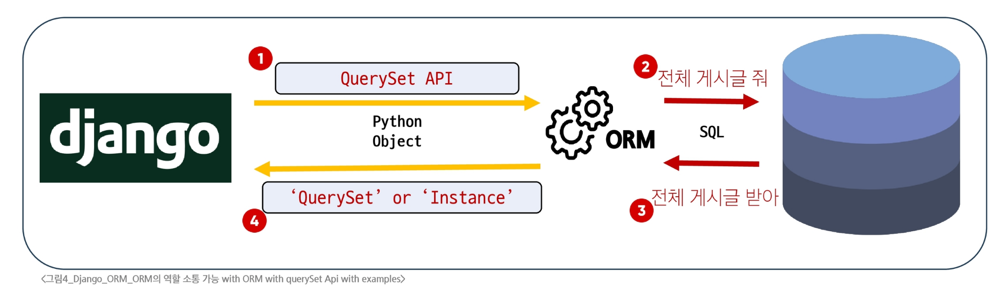

### ORM
- ORM(Object-Relational-Mapping)
  - 객체 지향 프로그래밍 언어의 객체와, 데이터베이스의 데이터를 매핑하는 기술
  - ORM은 Django 개발자를 위해 'QuerySet API'라는 특별한 도구를 제공

### QuerySet API
- QuerySet API
  - 데이터베이스의 복잡한 SQL 쿼리문을 직관적인 Python 코드로 다룰 수 있게 해주는 강력한 번역기
  - 개발자는 SQL을 직접 작성하지 않고도 .filter(), .exclude(), .order_by() 등 파이썬다운 메서드를 사용하여 원하는 데이터를 손쉽게 생성, 수정, 삭제 할 수 있음
  - 코드의 가독성을 높이고, 개발 생산성을 극대화
- QuerySet API 구분 기본 구조
  - Article.objects.all()
    - Article(모델 클래스)
      - 역할: 데이터베이스 테이블에 대한 python 클래스 표현
    - .objects(매니저)
      - 역할: 데이터베이스 조회(Query) 작업을 위한 기본 인터페이스
      - 모델 클래스가 데이터베이스 쿼리 작업을 수행할 수 있도록 하는 진입점
      - Django는 모든 모델에 objects라는 이름의 매니저를 자동으로 추가
    - .all(QuerySet API 메서드)
      - 역할: 특정 데이터베이스 작업을 수행하는 명령
      - 매니저를 통해 호출되는 메서드로, 해당 모델과 연결된 테이블의 모든 레코드(rows)를 조회하려는 SQL 쿼리를 생성하고 실행
- QuerySet API와 ORM의 동작 방식

- QuerySet이란?
  - 데이터베이스에서 전달받은 객체 목록(데이터 모음)
  - 순회 가능한 데이터로, 1개 이상의 데이터를 불러와 사용 가능
  - Django ORM을 통해 만들어진 자료형
  - 단, 데이터베이스가 단일 객체를 반환할 때는 QuerySet이 아닌 모델(Class)의 인스턴스로 반환됨
- CRUD
  - Create, Read, Update, Delete를 묶어 이르는 말
  - 대부분의 소프트웨어가 가지는 기본적인 데이터 처리 기능

### Read
- 대표적인 조회 메서드
  - QuerySet 반환 메서드
    - all()
    - filter()
  - QuerySet을 반환하지 않는 메서드
    - get()
- all()
  - 전체 데이터 조회
  - Article.objects.all()
- filter()
  - 주어진 매개변수와 일치하는 객체를 포함하는 QuerySet 반환
  - Article.objects.filter(content='django!')
  - Article.objects.filter(title='first')
- get()
  - 주어진 매개변수와 일치하는 객체를 반환
  - QuerySet을 반환하지 않음
  - Article.objects.get(pk=1)
  - Article.objects.get(content='django!')  -> MultipleObjectsReturned(에러)
  - 단일한 데이터를 조회할 때 사용하는 메서드
- get()의 특징
  - 객체를 찾을 수 없으면 DoesNotExist 예외를 발생
  - 둘 이상의 객체를 찾으면 MultipleObjectsReturned 예외를 발생
  - 위와 같은 특징을 가지고 있기 때문에 primary_key(pk)와 같이 고유성을 보장하는 조회에서 사용해야 함

### Update
- 데이터 수정 방법
  - 인스턴스 변수를 변경 후 save 메서드 호출
  - article = Article.objects.get(pk=1)
  - article.title = 'byebye'
  - article.save()

### Delete
- 데이터 삭제 방법
  - 삭제하려는 데이터 조회 후 delete 메서드 호출
  - article = Article.objects.get(pk=1)
  - article.delete()