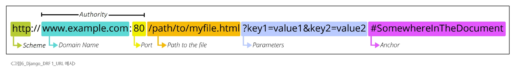

### REST API
#### API
- API
  - 두 소프트웨어가 서로 통신할 수 있게 하는 메커니즘

#### REST API
- REST(Representational State Transfer)
  - API Server를 개발하기 위한 일종의 소프트웨어 설계 방법론
- RESTful API
  - 각각 API서버 구조를 작성하는 모습이 너무 달라, 통일해서 쓰자는 일종의 약속
- REST에서의 자원 정의
  - 자원의 식별: URI
  - 자원의 행위: HTTP Methods
  - 자원의 표현: JSON 데이터
    - 궁극적으로 표현되는 데이터 결과물

#### 자원의 식별
- URI(Uniform Resource Identifier, 통합 자원 식별자)
  - 인터넷에서 리소스(자원)를 식별하는 문자열
- URL(Uniform Resource Locator, 통합 자원 위치)
  - 웹에서 주어진 리소스의 주소
  - 네트워크 상에 리소스가 어디 있는지를 알려주기 위한 약속

- Schema(or Protocol)
  - 브라우저가 리소스를 요청하는 데 사용해야 하는 규약
  - 기본적으로 웹은 http(s)를 요구
    - 메일을 열기위한 mailto:, 파일을 전송하기 위한 ftp:등 다른 프로토콜도 존재
- Domain Name
  - 요청 중인 웹 서버
  - 어떤 웹 서버가 요구되는 지를 가리키며 직접 IP 주소로 사용하는 것도 가능하지만, 사람이 외우기 어렵기 때문에 주로 Domain Name으로 사용
- Port
  - 웹 서버의 리소스에 접근하는데 사용되는 기술적인 Gate
  - HTTP 프로토콜의 표준 포트
    - HTTP - 80
    - HTTPS - 443
  - 표준 포트만 작성 시 생략 가능
- Path
  - 웹 서버의 리소스 경로
  - 초기에는 실제 파일이 위치한 물리적 위치를 나타냈지만, 오늘날은 실제 위치가 아닌 추상화된 형태의 구조를 표현
- Parameters
  - 웹 서버에 제공하는 추가적인 데이터
  - '&' 기호로 구분되는 key-value 쌍 목록
  - 서버는 리소스를 응답하기 전에 이러한 파라미터를 사용하여 추가 작업을 수행할 수 있음
- Anchor
  - 일종의 북마크를 나타내며, 브라우저에 해당 지점에 있는 컨텐츠를 표시
  - '#' 이후 부분은 서버에 전송되지 않음

#### 자원의 행위
- HTTP Request Methods
  - 리소스에 대한 행위
  - 수행하고자 하는 동작을 정의
- HTTP Request Methods 종류
  - GET
    - 서버에 리소스의 표현을 요청
    - GET을 사용하는 요청은 데이터만 검색해야 함
  - POST
    - 데이터를 지정된 리소스에 제출
    - 서버의 상태를 변경
  - PUT
    - 요청한 주소의 리소스를 수정
  - DELETE
    - 지정된 리소스를 삭제
- HTTP response status codes
  - 특정 HTTP 요청이 성공적으로 완료되었는지 여부를 나타냄
  - 100~199: 요청을 계속 진행중이라는 중간 응답
  - 200~209: 요청이 정상적으로 처리됨
  - 300~399: 요청한 리소스가 다른 위치로 옮겨짐
  - 400~499: 클라이언트 요청에 문제가 있음
  - 500~599: 서버 내부의 문제로 요청을 처리하지 못함

#### 자원의 표현
- 기존의 서버 응답
  - 지금까지는 Django 서버가 사용자에게 페이지(html)만 응답하고 있었음
  - 하지만 서버는 다양한 데이터 타입을 응답할 수 있음
  - REST API는 이 중에서도 JSON 타입으로 응답하는 것을 권장함
- 응답 데이터 타입의 변화
  - 기존에는 페이지만을 서버가 응답
  - 이제는 JSON 데이터를 응답하는 REST API 서버로 변환
  - 더이상 Django는 Template 부분에 대한 역할을 담당하지 않음
    - Front-end와 Back-end가 분리되어 구성
  - Django를 사용해 RESTful API 서버를 구축
  - 전통적 Django 앱 구조 -> 현대적 분리 구조로 전환

#### JSON 데이터 응답
