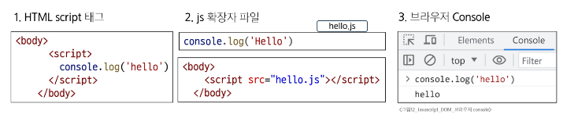
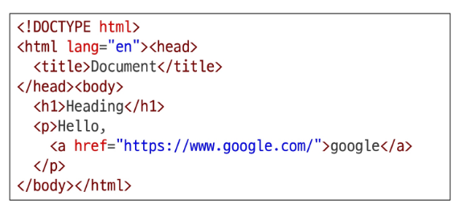
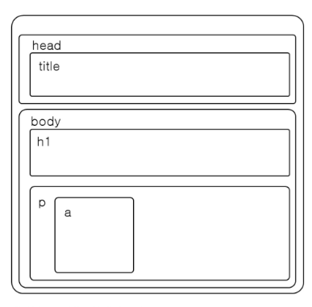

### JavaScript
#### 변수
- 변수 작성 규칙
  - 식별자(변수명)
    - 반드시 문자, 달러('$'), 밑줄('_')로 시작
    - 대소문자를 구분
    - 예약어 사용 불가
      - for, if, function 둥
- Naming Convention
  - 카멜 케이스(camelCase)
    - 변수, 객체, 함수에 사용
  - 파스칼 케이스(PascalCase)
    - 클래스, 생성자에 사용
  - 대문자 스네이크 케이스(SNAKE_CASE)
    - 상수(constants)에 사용
  - 가장 중요한것은 `일관성`이고, 팀의 스타일 가이드를 따르는 것을 우선할 것

#### 변수 선언 키워드
- 변수 선언 키워드 3가지
  - let
    - 재할당이 필요한 변수를 선언할 때 사용
  - const
    - 재할당이 불가능한 상수를 선언할 때 사용
  - var(사용 x)
    - 재선언/재할당이 가능하고, `현재는 호이스팅(Hoisting) 문제로 사용을 권장하지 않음`
- let
  - 블록 스코프(block scope)를 갖는 지역 변수를 선언
  - `재할당 가능`, 재선언 불가능, ES6에서 추가
```javascript
let number = 10   // 1. 선언 및 초기값 할당
number = 20   // 2. 재할당
```
- const
  - 블록 스코프(block scope)를 갖는 지역 변수를 선언
  - `재할당 불가능`, 재선언 불가능, ES6에서 추가
```javascript
const number = 10  // 1. 선언 및 초기값 할당
number = 10   // 2. 재할당 불가능
```
- 블록 스코프(block scope)
  - if, for, function 등의 `중괄호({}) 내부`를 가리킴
  - 블록 스코프를 가지는 변수는 블록 바깥에서 접근 불가능
  - 스코프 안에서 'let'으로 선언하면 밖에서 접근할 수 없음
- 어떤 변수 선언 키워드를 사용해야 할까?
  - `const를 기본으로 사용할 것!`
    - 코드의 의도 명확화
      - 해당 변수가 재할당되지 않을 것임을 명확히 표현
      - 개발자들에게 변수의 용도와 동작을 더 쉽게 이해할 수 있게 해줌
    - 버그 예방
      - 의도치 않은 변수 값 변경으로 인한 버그를 예방해서 큰 규모의 프로젝트나 팀 작업에서 중요
- 필요한 경우에만 let으로 전환(재할당이 필요한 경우)
  - let을 사용하는 것은 해당 변수가 의도적으로 변경될 수 있음을 명확히 나타냄
  - 코드의 유연성을 확보하면서도 const의 장점을 최대한 활용할 수 있음

#### DOM
- 웹 브라우저에서의 JavaScript
  - 웹 페이지에서 동적인 기능을 담당


#### 문서 구조
- Document structure
  - HTML 문서는 여러 상자가 중첩된 구조로 볼 수 있음


  - 각 상자는 객체이며, 개발자는 이 객체와 상호작용하여 어떤 HTML 태그를 나타내는지, 어떤 콘텐츠가 포함되어 있는지 등을 알아낼 수 있음
  - 이 표현을 객체모델(Document Object Model), 줄여서 DOM이라 부름
- DOM
  - 웹 페이지를 구조화된 객체로 제공하여 프로그래밍 언어가 페이지 구조에 접근할 수 있는 방법을 제공
  - 문서 구조, 스타일, 내용 등을 변경할 수 있도록 함
- DOM API
  - 다른 프로그래밍 언어가 웹 페이지에 접근 및 조작 할 수 있도록, 페이지 요소들을 객체 형태로 제공하며 관련된 메서드*(Method)도 함께 제공
  - HTML 구조와 내용을 조작하는 명령어 모음

#### Document 객체
- document 객체
  - 웹 페이지를 나타내는 DOM 트리의 최상위 객체
    - DOM 트리: HTML 태그들의 관계를 나무 모양으로 만든 계층 구조
  - HTML 문서의 모든 콘텐츠에 접근하고 조작할 수 있는 진입점

  - DOM에서 모든 요소, 속성, 텍스트는 하나의 객체
  - 모두 document 객체의 하위 객체로 구성됨


#### DOM tree
- DOM tree
  - HTML 태그를 나타내는 elements의 node는 문서의 구조를 결정
  - 이들은 다시 자식 node를 가질 수 있음(ex. document.body)
- DOM
  - DOM은 문서를 부모-자식 관계의 계층적인 트리 구조로 표현
  - DOM 조작은 웹페이지에 실시간으로 반영되어, 사용자와 상호작용하는 동적 페이지를 만듦

#### 선택 메서드
- document.querySelector(selector)
  - 요소 한 개 선택
  - 제공한 선택자(selector)와 일치하는 `첫 번째 요소`를 하나 선택
  - 제공한 선택자를 만족하는 첫 번째 element 객체를 반환 (없다면 null 반환)
- document.querySelectorAll(selector)
  - 요소 여러 개 선택
  - 제공한 선택자와 일치하는 여러 element를 선택
  - 제공한 선택자를 만족하는 NodeList를 반환

#### DOM 조작
- 속성(attribute) 조작
  - 클래스 속성 조작
  - 일반 속성 조작
- HTML 콘텐츠 조작
- DOM 요소 조작
- 스타일 조작

#### 속성 조작
- 클래스(class) 속성 조작
  - 'classList' property
  - 요소의 클래스 목록을 DOMTokenList(유사 배열) 형태로 반환
  - HTML 요소의 클래스 목록을 쉽게 제어(추가/제거)하는 도구
- classList 메서드
  - element.classList.add()
    - 지정한 클래스 값을 추가
  - element.classList.remove()
    - 지정한 클래스 값을 제거
  - element.classList.toggle()
    - 클래스가 존재한다면 제거하고 false를 반환
    - 존재하지 않으면 클래스를 추가하고 true를 반환
    - toggle: 있으면 제거하고, 없으면 추가하는 식으로 상태를 바꾸는 기능
- 일반 속성 조작 메서드
  - Element.getAttribute()
    - 해당 요소에 지정된 값을 반환(조회)
  - Element.setAttribute(name, value)
    - 지정된 요소의 속성 값을 설정
    - 속성이 이미 있으면 기존 값을 갱신
      - 그렇지 않으면 지정된 이름과 값으로 새 속성이 추가
  - Element.removeAttribute()
    - 요소에서 지정된 이름을 가진 속성 제거
  - 일반 속성 조작은 가급적 사용하지 말고, 클래스 속성 조작을 사용할 것
- HTML 콘텐츠 조작
  - 'textContent' property
  - 요소의 텍스트 콘텐츠를 표현
  - HTML 태그를 완전히 제거하고 순수한 텍스트 데이터만 얻고 싶을 때 가장 유용함

#### DOM 요소 조작
- DOM 요소 조작 메서드
  - document.createElement(tagName)
    - 작성한 tagName의 HTML 요소를 생성하여 반환
  - Node.appendChild()
    - 한 Node를 특정 부모 Node의 자식 NodeList 중 마지막 자식으로 삽입
    - 추가된 Node 객체를 반환
  - Node.removeChild()
    - DOM에서 자식 Node를 제거
    - 제거된 Node를 반환

#### style 조작
- Style 조작
  - `거의 사용하지 않고, 클래스를 활용함`