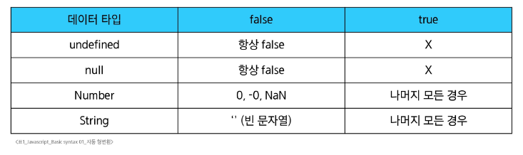

### JS 기본문법
#### 데이터 타입
- 원시 자료형(Primitive type)
  - 값 자체가 변수에 직접 저장되는 자료형
  - 불변이며, 변수 간 할당 시 값이 복사
  - Number, String, Boolean, null, undefined
- 참조 자료형(Reference type)
  - 데이터가 저장된 메모리의 주소가 변수에 저장되는 자료형
  - 가변이며, 변수 간 할당 시 주소가 복사
  - Objects(Object, Array, Function)

#### 원시 자료형
- Number
  - 정수 또는 실수형 숫자를 표현하는 자료형
  - 2.998e8, Infinity, NaN(Not a Number) 등 포함
  - 문자열과 + 연산 시, 숫자가 문자열로 자동 형 변환되어 연결
  - 정수와 실수 구분이 없고, 모든 숫자를 단일 타입으로 처리
- String
  - 텍스트 데이터를 표현하는 자료형
  - '+' 연산자를 사용해 문자열끼리 결합
  - 뺄셈, 곱셈, 나눗셈 불가능
- Template literals (템플릿 리터럴)
  - 내장된 표현식을 허용하는 향상된 문자열 작성 방식
  - Backtick(` `)을 이용하며, 여러 줄에 걸쳐 문자열을 정의할 수도 있고 `JavaScript의 변수를 문자열 안에 바로 연결할 수 있음`.
  - 표현식은 '$'와 중괄호로 표기
```Javascript
const age = 100
const message = `홍길동은 ${age}세입니다.`
console.log(message)
```
- null
  - 프로그래머가 의도적으로 `값이 없음`을 나타낼 때 사용
- undefined
  - 시스템이나 JavaScript 엔진이 `값이 할당되지 않음`을 나타낼 때 사용
- Boolean
  - 참과 거짓을 나타내는 논리적인 자료형
  - 조건문 또는 반복문에서 Boolean이 아닌 데이터 타입은 "자동 형변환 규칙"에 따라 true 또는 false로 변환
  - 빈 리스트, 빈 딕셔너리 등은 주소값이 있으므로 `true`로 나옴
```JavaScript
console.log(Boolean([])); // true
console.log(Boolean({})); // true
```


#### 연산자
- 할당 연산자
  - 오른쪽에 있는 피연산자의 평가 결과를 왼쪽 피연산자에 할당하는 연산자
  - 단축 연산자 지원
```JavaScript
let a = 0
a += 0
console.log(a) // 10
```
- 증가 & 감소 연산자
  - 증가 연산자('++')
    - 피연산자를 증가(+1)시키고 연산자의 위치에 따라 증가하기 전이나 후의 값을 반환
  - 감소 연산자('--')
    - 피연산자를 감소(-1)시키고 연산자의 위치에 따라 감소하기 전이나 후의 값을 반환
  - 코드의 가독성을 위해 a += 1, a -= 1과 같이 더 명시적인 표현을 권장
```JavaScript
let x = 3
const y = x++
console.log(x, y) // 4 3

let a = 3
const b = ++a
console.log(a, b) // 4 4
```
- 비교 연산자
  - 피연산자들(숫자, 문자, Boolean 등)을 비교하고 결과 값을 boolean으로 반환하는 연산자
  - 문자끼리의 비교는 유니코드를 비교
- 동등 연산자(==)
  - 두 피연산자가 같은 값으로 평가되는지 비교한 후 boolean 값을 반환
  - `암묵적 타입 변환`을 통해 타입을 일치시킨 후 같은 값인지 비교
  - 두 피연산자가 모두 객체일 경우, 메모리의 같은 객체를 바라보는지 판별
  - 거의 사용하지 않고, 일치연산자(===)를 사용
```JavaScript
console.log(1 == 1) // true
console.log('hello' == 'hello') // true
console.log('1' == 1) // true
console.log(0 == false) // true
```
- 일치 연산자(===)
  - 두 피연산자의 값과 타입이 모두 같은 경우 true를 반환
  - 같은 객체를 가리키거나, 같은 타입이면서 같은 값인지를 비교
  - 엄격한 비교가 이루어지며 암묵적 타입 변환이 발생하지 않음
  - 특별한 경우를 제외하고는, 예측하지 못한 결과를 방지하기 위해 일치연산자 사용을 권장
```JavaScript
console.log(1 == 1) // true
console.log('hello' == 'hello') // true
console.log('1' == 1) // false
console.log(0 == false) // false
```
- 논리 연산자
  - and 연산: '&&'
  - or 연산: '||'
  - not 연산: '!'
  - 단축 평가 지원
```JavaScript
true && false // false
true && true // true

false || true // true
false || false // false

!true // false

1 && 0 // 0
0 && 1 // 0
4 && 7 // 7
1 || 0 // 1
4 || 7 // 4
```

#### 조건문
- if
```JavaScript
const name = 'customer'
if (name === 'admin') {
    console.log('관리자님 환영해요')
} else if (name === 'customer') {
  console.log('고객님 환영해요')
} else {
  console.log('반갑습니다. ${name}님')
}
```
- 삼항 연산자
  - 간단한 조건부 로직을 간결하게 표현할 때 유용
  - condition ? expression1 : expression2
  - condition
    - 평가할 조건 (true 또는 false로 평가)
  - expression1
    - 조건이 true일 경우 반환할 값 또는 표현식
  - expression2
    - 조건이 false일 경우 반환할 값 또는 표현식

#### 반복문
- while
  - 조건이 참이면 문장을 계속해서 수행
```JavaScript
let i = 0
while (i < 6) {
    console.log(i)
    i += 1
}
```
- for 반복문
  - 특정한 조건이 거짓으로 판별될 때까지 반복
```JavaScript
for (let i = 0; i < 6; i++) {
    console.log(i)
}
```
- for ... in 반복문
  - 객체의 열거 가능한 속성의 키(key)에 대해 반복
  - 자주 사용하지는 않음
```JavaScript
const fruits = { a: 'apple', b: 'banana' }
for (const property in fruits) {
    console.log(property) // a, b
    console.log(fruits[property]) // apple, banana
}
```
- for ... of 반복문
  - 반복가능한 객체(배열, 문자열 등)의 값(value)에 대해 반복
```JavaScript
const numbers = [0, 1, 2, 3]
for (const number of numbers) {
    console.log(number) // 0, 1, 2, 3
}
```

#### 함수
- 함수 구조
```JavaScript
function name ([param[, param, [..., param]]]) {
    statements
    return value
}
```
  - function 키워드
  - 함수의 이름
  - 함수의 매개변수
  - 함수의 body를 구성하는 statements
  - return 문이 없거나 return 뒤에 값이 없으면, 함수는 undefined를 반환
- 함수를 정의하는 2가지 방법
  - 선언식 (function declaration)
  - 표현식 (function expression)
    - 주로 표현식으로 사용함
- 함수 선언식 특징
  - 호이스팅이 됨
    - 자바스크립트 엔진이 코드 실행 전 변수와 함수 선언을 스코프 최상단으로 끌어올리는 동작 방식
    - 선언식으로 된 함수는 선언 전에 호출하는 것이 가능
  - 코드의 구조와 가독성 면에서는 표현식에 비해 장점이 있음
```JavaScript
add(1, 2) // 3

function add (num1, num2) {
    return num1 + num2
}
```
- 함수 표현식 특징
  - 호이스팅 되지 않음
    - 변수 선언만 호이스팅되고 함수 할당은 실행 시점에 이루어짐
  - 함수 이름이 없는 '익명 함수'를 사용할 수 있음
```JavaScript
sub(2, 1) // ReferenceError:

const sub = function (num1, num2) {
    return num1 - num2
}
```
- 함수 표현식 사용을 권장하는 이유
  - 예측 가능성
    - 호이스팅의 영향을 받지 않아 코드 실행 흐름을 더 명확하게 예측할 수 있음
  - 유연성
    - 변수에 할당되므로 함수를 값으로 다루기 쉬움
  - 스코프 관리
    - 블록 스코프를 가지는 let이나 const와 함께 사용하여 더 엄격한 스코프 관리가 가능

#### 매개변수
- 매개변수 정의 방법
  - 기본 함수 매개 변수
  - 나머지 매개 변수
- 기본 함수 매개변수
  - 함수 호출 시 인자를 전달하지 않거나 undefined를 전달할 경우, 지정된 기본값으로 매개변수를 초기화
```JavaScript
const greeting = function (name = 'Anonymous') {
    return `Hi ${name}`
}

greeting() // Hi Anonymous
```
- 나머지 매개변수
  - 정해지지 않은 개수의 인자들을 배열로 모아서 받는 방법
  - 작성 규칙
    - 함수 정의 시 나머지 매개변수는 하나만 작성할 수 있음
    - 나머지 매개변수는 함수 정의에서 매개변수 마지막에 위치해야 함
```JavaScript
const myFunc = function (param1, param2, ...restPrams) {
    return [param1, param2, restPrams]
}

myFunc(1, 2, 3, 4, 5) // [1, 2, [3, 4, 5]]
myFunc(1, 2) // [1, 2, []]
```
- 매개변수와 인자 개수가 불일치 할 때
  - 매개변수 개수 > 인자 개수
    - 누락된 인자는 undefined으로 할당
```JavaScript
const threeArgs = function (param1, param2, param3) {
    return [param1, param2, param3]
}

threeArgs() // [undefined, undefined, undefined]
threeArgs(1) // [1, undefined, undefined]
threeArgs(2, 3) // [2, 3, undefined]
```
  - 매개변수 개수 < 인자 개수
    - 초과 입력한 인자는 사용하지 않음
```JavaScript
const noArgs = function () {
    return 0
}
noArgs(1, 2, 3) // 0

const twoArgs = function (param1, param2) {
    return [param1, param2]
}
twoArgs(1, 2, 3) // [1, 2]
```

#### Spread syntax
- Spread syntax '...'
  - 전개 구문
  - 배열이나 문자열처럼 반복 가능한 항목들을 개별 요소로 펼치는 것
  - 전개 대상에 따라 역할이 다름
    - 배열이나 객체의 요소를 개별적인 값으로 분리하거나 다른 배열이나 객체의 요소를 현재 배열이나 객체에 추가하는 등
- 전개 구문 활용처
  - 함수와의 사용
    - 함수 호출 시 인자 확장
    - 나머지 매개변수 (압축)
  - 객체와의 사용 (객체 파트에서 진행)
   